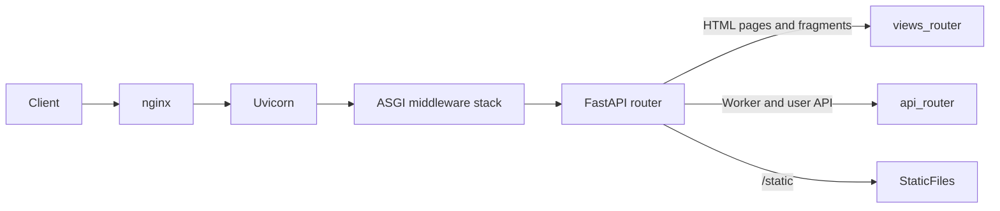

# Server Architecture

This page maps the fishtest server: what each module owns, how a request
travels from Uvicorn to a response, what runs at startup and shutdown, which
background tasks and caches exist, and which invariants hold across them.
Every subsystem below names the file and symbol that implements it.

## What fishtest does

Fishtest is a distributed chess engine testing infrastructure. The server:

1. Accepts test submissions from developers (new Stockfish patches).
2. Assigns work units (tasks) to volunteer worker machines.
3. Collects game results and computes statistical tests (SPRT, ELO).
4. Publishes results through a web dashboard and a JSON API.

A single MongoDB instance is the system of record. All run state, user
accounts, action logs, and neural network metadata are stored there.

## Repository layout

```
server/
|-- pyproject.toml           -- Package metadata, dependencies, ruff config
|-- uv.lock                  -- Locked server dependency set
|-- fishtest/
|   |-- app.py               -- ASGI application factory, lifespan, middleware, routers
|   |-- api.py               -- API router (20 endpoints: 9 worker + 11 read-only)
|   |-- views.py             -- UI router (33 routes, data-driven dispatch,
|   |                          routing hub)
|   |-- views_helpers.py     -- Pure stateless helpers extracted from views.py
|   |-- views_actions.py     -- Actions-page helpers (row building, sorting, query strings)
|   |-- views_finished.py    -- Finished-runs page helpers (pagination, filtering)
|   |-- views_machines.py    -- Machines-page helpers (normalization, filter state)
|   |-- views_run.py         -- Run creation/modification helpers (validation, lifecycle)
|   |-- rundb.py             -- RunDb: run lifecycle, task distribution, caching
|   |-- userdb.py            -- UserDb: authentication, groups, registration
|   |-- actiondb.py          -- ActionDb: audit log
|   |-- workerdb.py          -- WorkerDb: worker blocking
|   |-- kvstore.py           -- KeyValueStore: MongoDB-backed dict-like metadata store
|   |-- scheduler.py         -- Periodic task scheduler (primary instance only)
|   |-- schemas.py           -- vtjson validation schemas
|   |-- run_cache.py         -- RunCache: in-memory run cache with buffered writeback
|   |-- lru_cache.py         -- Generic LRU cache and @lru_cache decorator
|   |-- constants.py         -- Username/password limits, supported arches and compilers
|   |-- spsa_workflow.py     -- Pure classic SPSA lifecycle helpers
|   |-- spsa_handler.py      -- SPSA worker orchestration, request/update flow, history buffering
|   |-- github_api.py        -- GitHub integration (commit metadata, branch resolution)
|   |-- util.py              -- Shared utilities (formatting, chi-square, run helpers)
|   |-- __init__.py          -- Minimal package init
|   |-- http/                -- HTTP support modules
|   |-- templates/           -- Jinja2 templates (53 files, .html.j2)
|   |-- static/              -- Static assets (css, js, img, html, robots.txt, favicon)
|   `-- stats/               -- Statistical computation modules
|-- tests/                   -- Focused unit and HTTP contract tests
`-- utils/                   -- Operational scripts (backup, indexes, migrations, analysis)
```

`views.py` remains the stable UI routing hub. The extracted `views_*.py` modules
hold domain logic, but route registration, `_dispatch_view()`, and the request
shim stay centralized there. Each extracted `views_*.py` module keeps a matching
dedicated test file under `server/tests/`. User-facing route-family UI tests
reuse `server/tests/ui_user_test_case.py` and stay grouped by route family or
one focused UI motif.

Classic SPSA server ownership is split deliberately. `spsa_workflow.py` holds
the pure classic SPSA helpers reused by the run form, the detail page, and the
worker lifecycle. `spsa_handler.py` stays attached to `RunDb` and owns the
stateful worker request/update path, flip packing, buffering, and history
timing.

### HTTP support modules (`server/fishtest/http/`)

```
http/
|-- __init__.py              -- Package init
|-- boundary.py              -- ApiRequestShim, get_request_shim, session commit,
|                               build_template_context
|-- cookie_session.py        -- CookieSession, secret key resolution, session helpers
|-- csrf.py                  -- CSRF token extraction and validation (csrf_or_403)
|-- dependencies.py          -- Request-scoped handle lookup (get_rundb, get_userdb, ...)
|-- errors.py                -- install_error_handlers: API/UI error routing
|-- jinja.py                 -- Jinja2 Environment, Jinja2Templates, static_url, globals
|-- middleware.py            -- Five pure-ASGI middleware classes
|-- open_graph.py            -- Open Graph / page metadata builders
|-- session_middleware.py    -- FishtestSessionMiddleware (itsdangerous cookie signing)
|-- settings.py              -- AppSettings plus shared numeric constants
|-- template_helpers.py      -- Jinja2 filters and global functions
|-- template_renderer.py     -- render_template_to_response
|-- ui_cookies.py            -- UI state cookie names, readers, and writers
|-- ui_errors.py             -- HTML error page rendering (404, 403)
`-- ui_pipeline.py           -- apply_http_cache: Cache-Control from view config
```

### Statistical modules (`server/fishtest/stats/`)

```
stats/
|-- __init__.py
|-- LLRcalc.py               -- Log-likelihood ratio computation, pdf helpers
|-- brownian.py              -- Brownian motion model used by sprt.py
|-- sprt.py                  -- Sequential probability ratio test
`-- stat_util.py             -- SPRT, SPRT_elo, get_elo, ELO estimation
```

## Module map

One line per module: what it owns, and which modules import it. Use this table
to find the owner of a behavior before searching the tree.

| Module | Owns | Imported by |
|--------|------|-------------|
| `app.py` | `create_app()`, `lifespan()`, middleware install order, static mount, router include | entrypoint (`uvicorn fishtest.app:app`) |
| `api.py` | `router`, `GenericApi`, `WorkerApi`, `UserApi`, `WORKER_VERSION`, `WORKER_API_PATHS` | `app.py`, `http/errors.py`, `http/middleware.py` |
| `views.py` | `router`, `_VIEW_ROUTES`, `_register_view_routes()`, `_dispatch_view()`, `_ViewContext` shim, all UI handlers | `app.py` |
| `views_helpers.py` | `pagination()`, param/sort/view normalization, `_is_hx_request()`, `Vary`/`no-store` header helpers, username merge | `views.py`, `views_actions.py`, `views_finished.py`, `views_machines.py`, `views_run.py` |
| `views_actions.py` | `/actions` row building, sorting, query strings | `views.py` |
| `views_finished.py` | `get_paginated_finished_runs()` and finished-runs query state | `views.py` |
| `views_machines.py` | `tests_machines()`, machine row normalization, filter cookies | `views.py` |
| `views_run.py` | Run form validation, SHA/net resolution, `can_modify_run()`, `del_tasks()` | `views.py` |
| `rundb.py` | `RunDb`: run lifecycle, task assignment, aggregation, locks, `task_semaphore` | `app.py`, `http/dependencies.py` |
| `userdb.py` | `UserDb`: authentication, groups, registration, machine limits | `rundb.py`, `http/dependencies.py` |
| `actiondb.py` | `ActionDb`: typed audit-log writers, `get_actions()` | `rundb.py`, `http/dependencies.py` |
| `workerdb.py` | `WorkerDb`: worker block list | `rundb.py`, `http/dependencies.py` |
| `kvstore.py` | `KeyValueStore`: `MutableMapping` over the `kvstore` collection | `rundb.py` |
| `run_cache.py` | `RunCache`, `Prio`, `active_run_lock()`, buffered writeback | `rundb.py`, `views.py` |
| `lru_cache.py` | `LRUCache` and the `@lru_cache` decorator (size, expiration, refresh) | `actiondb.py`, `github_api.py`, `run_cache.py`, `rundb.py`, `userdb.py` |
| `scheduler.py` | `Scheduler`, `Task`: single-thread periodic execution | `rundb.py` |
| `schemas.py` | All vtjson schemas, `RUN_VERSION`, computed-field helpers, `legacy_usernames` | `actiondb.py`, `api.py`, `github_api.py`, `kvstore.py`, `run_cache.py`, `rundb.py`, `userdb.py`, `views.py`, `views_run.py`, `workerdb.py` |
| `constants.py` | `PASSWORD_MAX_LENGTH`, `VALID_USERNAME_PATTERN`, `supported_arches`, `supported_compilers` | `schemas.py` |
| `spsa_workflow.py` | Pure classic SPSA helpers: form values, param parsing, chart payload | `spsa_handler.py`, `views.py`, `views_run.py` |
| `spsa_handler.py` | `SPSAHandler`: worker request/update path, flip packing, history buffering | `rundb.py` |
| `github_api.py` | GitHub REST calls, rate-limit accounting, persistent API cache, `official_master_sha` | `api.py`, `app.py`, `rundb.py`, `userdb.py`, `util.py`, `views.py`, `views_run.py`, `http/jinja.py` |
| `util.py` | Formatting, `get_chi2()`, `format_results()`, `estimate_game_duration()`, `strip_run()`, `FISHTEST` db name | `actiondb.py`, `api.py`, `rundb.py`, `views.py`, `views_machines.py`, `views_run.py`, `http/jinja.py`, `http/template_helpers.py` |
| `http/settings.py` | `AppSettings`, `THREADPOOL_TOKENS`, `TASK_SEMAPHORE_SIZE`, poll intervals, page sizes, form limits | `app.py`, `rundb.py`, `views.py`, `views_finished.py`, `views_machines.py`, `http/boundary.py`, `http/jinja.py`, `http/session_middleware.py` |
| `http/middleware.py` | `HeadMethodMiddleware`, `ShutdownGuardMiddleware`, `AttachRequestStateMiddleware`, `RejectNonPrimaryWorkerApiMiddleware`, `RedirectBlockedUiUsersMiddleware` | `app.py` |
| `http/session_middleware.py` | `FishtestSessionMiddleware` | `app.py` |
| `http/cookie_session.py` | `CookieSession`, `load_session()`, `authenticated_user()`, `session_secret_key()` | `app.py`, `views.py`, `http/boundary.py`, `http/csrf.py`, `http/dependencies.py`, `http/middleware.py`, `http/session_middleware.py`, `http/ui_errors.py` |
| `http/boundary.py` | `ApiRequestShim`, `get_request_shim()`, `build_template_context()`, `commit_session_*()` | `api.py`, `views.py`, `http/ui_errors.py` |
| `http/dependencies.py` | `get_rundb()`, `get_userdb()`, `get_actiondb()`, `get_workerdb()`, `get_request_context()` | `views.py`, `http/boundary.py` |
| `http/csrf.py` | `csrf_token_from_form()`, `csrf_is_valid()`, `csrf_or_403()` | `views.py`, `http/boundary.py` |
| `http/errors.py` | `install_error_handlers()` and the three handler callables | `app.py` |
| `http/ui_errors.py` | `render_notfound_response()`, `render_forbidden_response()` | `http/errors.py` |
| `http/jinja.py` | `default_environment()`, `default_templates()`, `static_url()`, template globals | `http/boundary.py`, `http/template_renderer.py` |
| `http/template_renderer.py` | `render_template_to_response()` | `views.py`, `http/ui_errors.py` |
| `http/template_helpers.py` | Jinja filters and globals (residuals, LLR display, run tables) | `views.py`, `http/open_graph.py` |
| `http/open_graph.py` | `default_open_graph()`, `build_tests_view_open_graph()`, `build_actions_open_graph()` | `views.py`, `http/boundary.py` |
| `http/ui_cookies.py` | UI state cookie names, `append_ui_cookie()`, `read_cookie_*()` | `views.py`, `views_machines.py` |
| `http/ui_pipeline.py` | `apply_http_cache()` | `views.py` |
| `stats/stat_util.py` | `SPRT()`, `SPRT_elo()`, `get_elo()` | `api.py`, `rundb.py`, `schemas.py`, `util.py`, `views.py`, `views_run.py`, `http/template_helpers.py` |
| `stats/sprt.py` | `sprt` class used by `stat_util` | `stats/stat_util.py`, `http/template_helpers.py` |
| `stats/LLRcalc.py` | LLR math, `results_to_pdf()`, `regularize()`, `nelo_divided_by_nt` | `stats/sprt.py`, `stats/stat_util.py`, `http/template_helpers.py` |
| `stats/brownian.py` | `Brownian` model | `stats/sprt.py` |

## Data store

`RunDb.__init__()` in `server/fishtest/rundb.py` opens `MongoClient("localhost")`
and selects the database named by `FISHTEST` in `server/fishtest/util.py`. All
collections are timezone-aware (`CodecOptions(tz_aware=True, tzinfo=UTC)`).

| Collection | Handle | Content |
|------------|--------|---------|
| `runs` | `RunDb.runs` | Test runs, including embedded `tasks` and `bad_tasks` |
| `pgns` | `RunDb.pgndb` | Gzipped PGN uploads per task |
| `nns` | `RunDb.nndb` | Neural network metadata and download counters |
| `deltas` | `RunDb.deltas` | IDs of finished runs already folded into the contributor totals |
| `kvstore` | `RunDb.kvstore` | `books`, `worker_runs`, `legacy_usernames`, `github_api_cache`, `official_master_sha` |
| `users` | `UserDb.users` | Accounts, groups, machine limits |
| `user_cache` | `UserDb.user_cache` | Cumulative per-user contribution totals |
| `top_month` | `UserDb.top_month` | Current-month per-user contribution totals |
| `actions` | `ActionDb.actions` | Audit log |
| `workers` | `WorkerDb.workers` | Worker block list and messages |

Index creation and the contributor aggregation are not performed by the
application. They live in `server/utils/create_indexes.py` and
`server/utils/delta_update_users.py`.

## Application startup

The entrypoint is `uvicorn fishtest.app:app`. `create_app()` in
`server/fishtest/app.py` builds the FastAPI instance with a lifespan context
manager that handles startup and shutdown. OpenAPI docs (`/docs`, `/redoc`,
`/openapi.json`) are disabled unless `OPENAPI_URL` is set; see
[7-development.md](7-development.md).

### create_app() order

1. `AppSettings.from_env()` for bootstrap values (only `openapi_url` is read
   before the lifespan runs).
2. `FastAPI(lifespan=..., openapi_url=...)`.
3. `install_error_handlers(app)` (`server/fishtest/http/errors.py`).
4. `app.add_middleware(...)` six times, innermost first.
5. `app.mount("/static", StaticFiles(directory=default_static_dir()))`.
6. `app.include_router(views_router)` then `app.include_router(api_router)`.

Route matching is first-match, and the UI router is registered first. UI paths
and API paths do not overlap, so registration order does not change dispatch.

### Startup sequence (lifespan)

1. `AppSettings.from_env()` reads `FISHTEST_PORT`, `FISHTEST_PRIMARY_PORT`, and
   `OPENAPI_URL`; the result is stored on `app.state.settings`.
2. `current_default_thread_limiter().total_tokens = THREADPOOL_TOKENS` resizes
   the AnyIO threadpool.
3. `_require_single_worker_on_primary()` raises `RuntimeError` if the instance
   is primary and `UVICORN_WORKERS` (or `WEB_CONCURRENCY`) is set to anything
   other than `1`. This prevents duplicated scheduler and GitHub side effects.
4. `RunDb(port, is_primary_instance)` is constructed in the threadpool. It
   connects to MongoDB, constructs `UserDb`, `ActionDb`, `WorkerDb`,
   `KeyValueStore`, `RunCache`, and `SPSAHandler`, loads `books` and
   `worker_runs` from the key-value store, and logs a `start fishtest@<port>`
   system event when `port >= 0`.
5. Handles are published on `app.state`: `rundb`, `userdb`, `actiondb`,
   `workerdb`.
6. `_install_sigusr1_thread_dump_handler()` registers the SIGUSR1 thread dump.
7. `schemas.legacy_usernames` is populated from the key-value store so every
   instance validates users against the same schema.
8. `gh.init(kvstore, actiondb, refresh_master_sha=is_primary_instance)` runs on
   **every** instance. It restores the persisted GitHub API cache. Only the
   primary refreshes `official_master_sha` over the network; secondaries read
   the last stored value.
9. On the primary instance only:
   - `rundb.update_aggregated_data()` rebuilds `unfinished_runs`, `wtt_map`, and
     `connections_counter` from MongoDB and repairs inconsistent computed run
     fields.
   - `rundb.schedule_tasks()` starts the periodic scheduler.

### Shutdown sequence

`_shutdown_rundb()` in `server/fishtest/app.py` runs in the lifespan `finally`
block. Each step is wrapped so a failure does not skip the following steps.

1. `rundb._shutdown = True` makes `ShutdownGuardMiddleware` reject new requests
   with HTTP 503.
2. `await asyncio.sleep(0.5)` drains in-flight requests.
3. `rundb.scheduler.stop()` stops the scheduler thread and joins it.
4. On the primary only: `rundb.run_cache.flush_all()` writes every dirty cached
   run, then `rundb.save_persistent_data()` stores `books`, `worker_runs`, and
   the GitHub API cache in the key-value store.
5. A `stop fishtest@<port>` system event is logged when `port >= 0`.
6. `rundb.conn.close()` closes the MongoDB connection.

## Middleware stack

Middleware is installed in `create_app()` and executes in reverse installation
order (outermost first in the request path). All classes live in
`server/fishtest/http/middleware.py` except the session middleware.

| Order | Middleware | Applies to | Responsibility |
|-------|-----------|------------|----------------|
| 1 | `FishtestSessionMiddleware` (`http/session_middleware.py`) | all HTTP | Reads and writes the signed session cookie (itsdangerous) |
| 2 | `RedirectBlockedUiUsersMiddleware` | paths not under `/api` or `/static` | Clears the session and redirects blocked users to `/tests` (302) |
| 3 | `RejectNonPrimaryWorkerApiMiddleware` | `PRIMARY_ONLY_WORKER_API_PATHS` | Returns JSON 503 with `error` and `duration` on non-primary instances |
| 4 | `AttachRequestStateMiddleware` | all HTTP | Stamps `request.state.request_started_at`, copies `app.state` handles to `request.state`, sets `rundb.base_url` once from the first request |
| 5 | `ShutdownGuardMiddleware` | all HTTP | Returns an empty 503 once `rundb._shutdown` is set |
| 6 | `HeadMethodMiddleware` | HEAD requests | Rewrites HEAD to GET and strips the response body (RFC 9110 Section 9.3.2) |

All middleware classes are pure ASGI (`__call__(self, scope, receive, send)`).
None use Starlette's `BaseHTTPMiddleware`.

Two consequences of this ordering are load-bearing:

- `RedirectBlockedUiUsersMiddleware` runs outside `AttachRequestStateMiddleware`,
  so it reads `scope["app"].state.userdb` directly rather than `request.state`.
- `RejectNonPrimaryWorkerApiMiddleware` excludes `/api/upload_pgn`
  (`PRIMARY_ONLY_WORKER_API_PATHS = WORKER_API_PATHS - {"/api/upload_pgn"}` in
  `server/fishtest/api.py`), because PGN uploads are routed to a dedicated
  non-primary backend.

## Request flow

High-level request path:



- **Worker API**: `api_router` handles all `/api/*` endpoints. Worker
  endpoints require authentication via `username`/`password` in the POST body.
- **UI**: `views_router` handles all HTML-rendering endpoints. Routes are
  registered from the `_VIEW_ROUTES` table via `_register_view_routes()`.
- **Static assets**: `StaticFiles` mount serves `/static/*`.

### Call chain: UI page

```
starlette route
  -> views.py::_make_endpoint().endpoint            [async wrapper]
    -> views.py::_dispatch_view(fn, cfg, request, path_params)
      -> http/dependencies.py::get_request_context() [session + db handles]
      -> request.form() + http/csrf.py::csrf_or_403()        [POST only]
      -> views.py::_ViewContext(...)                 [request shim]
      -> run_in_threadpool(fn, shim)                 [the view handler body]
        -> rundb.py::RunDb.<method>()                [MongoDB or run cache]
      -> run_in_threadpool(http/template_renderer.py::render_template_to_response)
        -> http/boundary.py::build_template_context()
        -> http/jinja.py Environment                 [renders cfg["renderer"]]
      -> http/boundary.py::commit_session_response()
      -> http/ui_pipeline.py::apply_http_cache()
      -> views_helpers.py::_append_vary_header() + _apply_response_headers()
```

A handler may return a `Response` directly (redirects, fragments, 204). In that
case `_dispatch_view()` skips rendering and applies only the session commit and
header steps. When `shim.response_status` is 204 the dispatcher returns an empty
`HTMLResponse` without touching the renderer.

### Call chain: worker API request

```
starlette route
  -> api.py::api_request_task(request)               [async wrapper]
    -> http/boundary.py::get_request_shim(request)   [await request.json()]
    -> run_in_threadpool(WorkerApi.request_task)
      -> WorkerApi.validate_request()                [vtjson api_schema]
        -> userdb.py::UserDb.authenticate()
      -> rundb.py::RunDb.request_task(worker_info)
        -> RunDb.task_semaphore.acquire(False)       [admission gate]
        -> RunDb.request_task_lock                   [mutex]
        -> RunDb.sync_request_task(worker_info)
          -> run_cache.py::RunCache.get_run() / buffer()
    -> JSONResponse
```

Every API route follows the same two-line shape: build the shim on the event
loop, then `run_in_threadpool()` the handler method. See
[3-api-reference.md](3-api-reference.md) for endpoint contracts and
[2-threading-model.md](2-threading-model.md) for the token accounting.

### htmx integration

UI templates load htmx 2.0.10 from a CDN in `base.html.j2`, alongside Bootstrap
and Font Awesome. The server remains fully server-rendered (Jinja2 and HTML
responses); the test detail page additionally loads jsdiff from the same CDN,
pinned with a subresource-integrity hash, and the Google Charts loader for the
SPSA chart. See [9-references.md](9-references.md) for the pinned versions. htmx adds three capabilities
without client-side rendering or a JavaScript build step:

| Capability | Mechanism |
|------------|-----------|
| Fragment polling | `hx-get` + `hx-trigger="every Ns"` fetches a fragment endpoint; server returns partial HTML |
| In-place content swap | `hx-get` + `hx-target` + `hx-swap="innerHTML"` replaces a page section (filters, pagination) |
| Out-of-band updates | `hx-swap-oob` attributes in the response update multiple DOM elements in one response |

**Dual-mode endpoints.** Several UI routes serve either a full page or an HTML
fragment from the same URL. The view handler calls
`views_helpers.py::_is_hx_request()` to detect the `HX-Request: true` header
(rejecting requests whose `Sec-Fetch-Mode` is `navigate`), then returns the
appropriate template via `views.py::_render_hx_fragment()`. `_dispatch_view()`
appends `Vary: HX-Request` to every GET response so that HTTP caches distinguish
the two representations.

**Cache policy is server-authoritative.** UI GET responses emit `Cache-Control`:
the dispatcher default is `no-cache, private`, auth-sensitive handlers call
`views_helpers.py::_append_no_store_headers()` to force `no-store`, and a route
config may set `http_cache` to add a short `max-age` (only `/tests/machines`
does). nginx must respect those headers and must not put `proxy_cache` in front
of UI routes. Aggressive proxy and browser caching remains appropriate for
immutable static assets only.

**Server-authoritative table state.** The htmx list pages (`/actions`,
`/contributors`, `/nns`, `/tests/finished`, `/tests/machines`, `/user_management`,
`/workers/show`) keep sort, search, page, and view state in the URL and render
the active control state server-side on every response. Where the htmx target
contains stateful controls, the swapped boundary is the full content fragment,
not just table rows. The shared active-search debounce is projected into
templates as `htmx.input_changed_delay_ms` from `server/fishtest/http/jinja.py`.

**Request coordination.** Poll-driven fragments that live inside a larger filter
form may use `hx-sync`, `hx-disinherit`, and `hx-params` to keep inherited form
state from corrupting sort/pagination links and to ensure explicit user actions
win over timer-driven refreshes.

**Fragment templates.** Fragment responses use standalone `.html.j2` files
(named `*_fragment.html.j2`) that do not extend `base.html.j2`. This avoids
the need for block-level partial rendering and keeps fragments self-contained.
See [5-templates.md](5-templates.md) for the full catalog and
[9-references.md](9-references.md) for the OOB and polling status-code rules.

**Detail-page polling shape.** The test detail page uses one visibility-aware
out-of-band poller, `/tests/view/{id}/detail`, which refreshes the ELO block,
run status, active-worker totals, detail table, time block, compact chi-square
block, and the embedded SPSA chart payload. It uses `hx-swap="none"` so the
poller element stays stable while htmx applies the out-of-band section updates.
The tasks table keeps its own conditional `/tests/tasks/{id}` poller because it
has a separate shell/body plus OOB-controls contract.

Run-list and detail polling intentionally use different data shapes. The
`/tests` and `/tests/user/{username}` run-table path rebuilds from
`RunDb.aggregate_unfinished_runs()` and the lightweight unfinished-run query,
which omits `tasks`, `bad_tasks`, and `args.spsa.param_history`. Detail routes
use full run data via `RunDb.get_run()` and the dedicated tasks poller.

**Visibility-aware polling policy.** Every periodic htmx poller follows a
three-part trigger policy:

1. A periodic trigger gated on `document.visibilityState === 'visible'`.
2. An immediate focus-return trigger using
   `visibilitychange[document.visibilityState === 'visible'] from:document`.
3. Section-scoped pollers (machines, tasks) additionally gate on the
   section's expanded state (`classList.contains('show')`).

This ensures background tabs do not generate server load and that
returning to the tab produces an immediate refresh. Poll intervals are not
hard-coded in templates; they come from the `poll` Jinja global defined in
`server/fishtest/http/jinja.py` and backed by the `POLL_*_S` constants in
`server/fishtest/http/settings.py`.

## Background scheduler

`RunDb.schedule_tasks()` in `server/fishtest/rundb.py` registers the periodic
work. It runs on the primary instance only, and only once per process.

`server/fishtest/scheduler.py` implements the scheduler. `Scheduler.__init__()`
starts one dedicated Python thread; every task body executes on that single
thread, so tasks never overlap and never consume AnyIO threadpool tokens. Tasks
created with `background=True` are dispatched to a short-lived daemon thread
instead, so a slow network call cannot delay the rest of the schedule. A task
that raises is logged to stdout and rescheduled. `Scheduler(jitter=0.05)`
spreads each due time by up to +/- 5 percent of its period.

| Task | Period | Background | What it does |
|------|-------:|:----------:|--------------|
| `RunCache.flush_buffers` | 1 s | no | Writes back the single oldest dirty cached run |
| `RunCache.clean_cache` | 60 s | no | Evicts clean entries for finished or idle runs |
| `RunDb.scavenge_dead_tasks` | 60 s | no | Reclaims tasks whose worker stopped reporting |
| `RunDb.update_itp` | 60 s | no | Recomputes internal test priority for every unfinished run |
| `RunDb.update_nps_gpm` | 60 s | no | Recomputes each unfinished run's `nps` and `games_per_minute` from its active tasks |
| `RunDb.clean_worker_runs` | 300 s | no | Drops `worker_runs` entries for finished runs |
| `RunDb.validate_random_run` | 180 s | no | Schema-validates one random unfinished run against `runs_schema` |
| `RunDb.clean_wtt_map` | 180 s | no | Drops stale worker-to-task entries |
| `RunDb.validate_data_structures` | 900 s | no | Schema-validates the run cache, `wtt_map`, `connections_counter`, `unfinished_runs`, `worker_runs`, and `books` |
| `RunDb.update_books` | 900 s | yes | Refreshes `books.json` from GitHub |
| `github_api.update_official_master_sha` | 900 s | yes | Refreshes the cached Stockfish master SHA |

Periods are literals in `RunDb.schedule_tasks()`; read that function before
relying on an exact cadence.

## Caches

The server keeps several distinct caches. Knowing which one serves a read is
usually the fastest way to explain stale data.

| Cache | Where | Scope | Invalidation |
|-------|-------|-------|--------------|
| Run cache | `run_cache.py` -> `RunCache.run_cache` | Primary instance only; `RunDb.get_run()` reads MongoDB directly on secondaries | `flush_buffers` (1 s, one entry), `flush_all` (shutdown), `clean_cache` (60 s) |
| Per-run write lock cache | `RunCache.active_run_lock()` | Maps run id to a re-entrant lock, itself `@lru_cache`d | Expiration only |
| User lookups | `userdb.py` `@lru_cache` on `find_by_username`, `get_usernames`, `get_pending`, `get_blocked` | Per process | `UserDb.clear_cache()` and per-decorator expiration |
| Blocked-user list for the UI | `http/middleware.py` -> `_get_blocked_cached()` | Per process, module-level, guarded by its own lock | Short TTL (`_BLOCKED_CACHE_TTL_SECONDS`) |
| Action usernames | `actiondb.py` -> `ActionDb.get_action_usernames()` | Per process | Expiration |
| Machine rows on secondaries | `rundb.py` -> `RunDb._get_machine_runs_from_db()` | Per process | Expiration |
| Run index names | `rundb.py` -> `RunDb.get_runs_index_names()` | Per process | Expiration |
| GitHub API responses | `github_api.py` -> `_lru_cache` | Per process, persisted to the `kvstore` collection by `gh.save()` | `gh.clear_api_cache()`, LRU eviction, cache-version mismatch on `gh.init()` |
| Static asset fingerprints | `http/jinja.py` -> `_static_file_token()` | Per process | Process restart |

Except for `_static_file_token()`, which uses `functools.lru_cache`, all of
these use `server/fishtest/lru_cache.py`. Its `@lru_cache` decorator supports
`maxsize`, `expiration`, `refresh`, and a result `filter`, and is not
`functools.lru_cache`. Do not assume the standard-library semantics when
reading a decorated method in `rundb.py`, `userdb.py`, or `actiondb.py`.

## Concurrency and locking

The event loop dispatches; blocking work runs in the AnyIO threadpool. See
[2-threading-model.md](2-threading-model.md) for domains, token accounting, and
the rules for new code.

`RunDb` state is shared across threadpool threads and the scheduler thread. The
locks are all created in `RunDb.__init__()` and `RunCache.__init__()`:

| Lock | Guards | Notes |
|------|--------|-------|
| `RunDb.request_task_lock` | The whole task-scheduling critical path | Only one thread runs `sync_request_task()` at a time |
| `RunDb.task_semaphore` | Admission to `request_task()` | Class attribute, size `TASK_SEMAPHORE_SIZE`; acquired non-blocking, so overflow callers get a "too busy" reply instead of holding a token |
| `RunDb.active_run_lock(run_id)` | Mutation of one run document and its writeback | Re-entrant, per run id, provided by `RunCache` |
| `RunCache.run_cache_lock` | The cache dictionary itself | Held only around dictionary access, never around MongoDB writes |
| `RunDb.unfinished_runs_lock` | `RunDb.unfinished_runs` set | |
| `RunDb.wtt_lock` | `RunDb.wtt_map` (worker to task) | Re-entrant |
| `RunDb.connections_lock` | `RunDb.connections_counter` | |
| `RunDb.worker_runs_lock` | `RunDb.worker_runs` | |

Invariants worth preserving when editing `rundb.py` or `run_cache.py`:

- Take `active_run_lock(run_id)` before writing a run document to MongoDB.
- Never hold `run_cache_lock` across a MongoDB call.
- Aggregate state (`unfinished_runs`, `wtt_map`, `connections_counter`) is
  primary-only and rebuilt by `update_aggregated_data()` at startup.
- `RunCache` is only authoritative on the primary; `RunDb.get_run()` bypasses it
  on secondaries.

## Primary instance model

Multiple Uvicorn instances run behind nginx. Exactly one is designated the
**primary**: `AppSettings.from_env()` marks the instance primary when
`FISHTEST_PORT == FISHTEST_PRIMARY_PORT`, or when either value is missing or
negative. See [8-deployment.md](8-deployment.md) for ports and unit files.

### Primary responsibilities

- Periodic scheduler (see "Background scheduler" above).
- Aggregated data rebuild at startup.
- Authoritative run cache and its writeback.
- Refreshing the official master SHA over the network.
- Run cache flush and persistent data save on shutdown.

### Secondary instances

- Serve UI traffic and read-only API traffic.
- Read runs straight from MongoDB instead of the run cache.
- Return JSON 503 for primary-only worker API paths (via
  `RejectNonPrimaryWorkerApiMiddleware`); `/api/upload_pgn` is exempt.
- Reject UI POSTs on routes marked `require_primary` with an HTML 503.
- nginx routes worker API traffic to the primary; UI traffic is distributed
  across all instances.

## Signals

| Signal | Behavior |
|--------|----------|
| SIGINT / SIGTERM | Uvicorn initiates graceful shutdown -> lifespan cleanup runs |
| SIGUSR1 | Dumps all thread stacks to stderr via `faulthandler.register()` |

The SIGUSR1 handler is installed by `_install_sigusr1_thread_dump_handler()` in
`server/fishtest/app.py` and is skipped on platforms without `signal.SIGUSR1`.
To trigger a thread dump on a systemd-managed instance, run
`sudo systemctl kill -s SIGUSR1 fishtest@8000`.

During shutdown, `ShutdownGuardMiddleware` rejects new requests with HTTP 503.

## Core domain adapters

These are not HTTP modules. They encapsulate business logic and MongoDB access.

| Adapter | Module | Responsibility |
|---------|--------|----------------|
| `RunDb` | `rundb.py` | Run lifecycle, task assignment, result aggregation, run cache |
| `UserDb` | `userdb.py` | User CRUD, password hashing (zxcvbn strength), group membership |
| `ActionDb` | `actiondb.py` | Audit trail for user and system actions |
| `WorkerDb` | `workerdb.py` | Worker ban list management |
| `KeyValueStore` | `kvstore.py` | Lightweight key-value pairs in MongoDB |
| `SPSAHandler` | `spsa_handler.py` | Classic SPSA worker request/update path |
| `Scheduler` | `scheduler.py` | Periodic background tasks on primary instance |

A single `RunDb` instance is created per process at startup and stored on
`app.state.rundb`. It owns the other adapters (`rundb.userdb`, `rundb.actiondb`,
`rundb.workerdb`, `rundb.kvstore`, `rundb.run_cache`, `rundb.spsa_handler`,
`rundb.scheduler`). Handlers reach them through
`server/fishtest/http/dependencies.py`, which reads `request.state` first and
falls back to `app.state`.

## Validation

vtjson is the sole validation layer. `server/fishtest/schemas.py` defines the
repository's vtjson schemas for plain Python dict validation. Schemas are used
in:

- API endpoints (request body validation).
- Domain adapters (run, user, action document validation before MongoDB writes).
- Form input validation (username format, worker name format).
- Scheduled self-checks (`validate_random_run`, `validate_data_structures`,
  `RunCache.validate`).

When raw form input and persisted document data intentionally have different
contracts, fishtest uses different vtjson schemas for those boundaries.
Raw-input schemas may be broader than the persisted-data schema, while the
persisted schema describes the canonical stored form validated before MongoDB
writes.

For contributor-facing vtjson rules and schema-change guidance, see
[7-development.md](7-development.md).

No Pydantic models are used anywhere in the codebase.

## Framework usage: FastAPI as a thin wrapper

This project uses FastAPI as a thin routing convenience layer on top of
Starlette. The FastAPI-exclusive features in use are:

1. **`FastAPI()`** -- the application class (inherits `starlette.Starlette`).
2. **`APIRouter`** -- decorator-style route registration in `api.py` and
   data-driven `add_api_route()` in `views.py`.
3. **`HTTPException`** and **`RequestValidationError`** -- raised by handlers and
   handled centrally in `http/errors.py`.
4. **Fallback exception handlers** from `fastapi.exception_handlers`.

The following FastAPI features are **not used**:

- Pydantic request/response models (`BaseModel`, `response_model`).
- Dependency injection (`Depends()`) in route signatures.
- Parameter declarations (`Body`, `Query`, `Path`, `Header`, `Cookie`).
- Security schemes (`OAuth2`, `HTTPBasic`, `APIKey`).

All middleware is pure ASGI (Starlette pattern). Session handling, CSRF
protection, authentication, and request validation use custom
implementations -- not FastAPI's built-in machinery.

Contributors should not expect Pydantic, DI, or security scheme patterns
in this codebase. When importing classes that FastAPI re-exports from
Starlette (`Request`, `Response`, `JSONResponse`, `StaticFiles`, etc.),
prefer importing from `starlette` directly.

## Error handling

Error handlers are installed via `install_error_handlers(app)` in
`server/fishtest/http/errors.py`. Three handlers are registered, for
`StarletteHTTPException`, `RequestValidationError`, and bare `Exception`.

| Condition | `/api/*` worker paths | other `/api/*` | UI routes |
|-----------|----------------------|----------------|-----------|
| `HTTPException` with a `dict` detail | that dict, verbatim | that dict, verbatim | that dict, verbatim |
| 401 / 403 | JSON `{"detail": ...}` | JSON `{"detail": ...}` | HTML login page, status 403 |
| 404 | JSON `{"detail": "Not Found"}` | JSON `{"detail": "Not Found"}` | HTML 404 page |
| Other `HTTPException` | JSON `{"detail": ...}` | JSON `{"detail": ...}` | JSON `{"detail": ...}` |
| Request validation error | JSON `{"error": "...", "duration": N}`, status 400 | JSON `{"detail": "Invalid request", "errors": [...]}`, status 400 | FastAPI default JSON 422 |
| Unhandled exception | JSON `{"error": "...", "duration": N}`, status 500 | JSON `{"detail": "Internal Server Error"}`, status 500 | Plain text 500 |

Worker endpoints raise `HTTPException` with a dict detail built by
`GenericApi.add_time()`, so the normal worker error path already carries
`error` and `duration`. The validation and unhandled-exception handlers
reproduce that shape for the paths in `WORKER_API_PATHS` so the worker protocol
stays stable even when the failure happens before the handler body runs.

The UI 404 and 403 pages are rendered by
`server/fishtest/http/ui_errors.py` (`render_notfound_response()` and
`render_forbidden_response()`); a rendering failure degrades to plain text.
