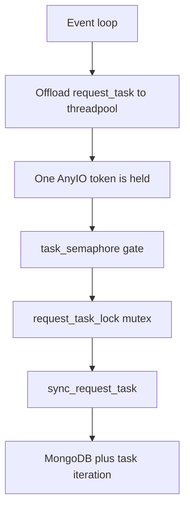

# Threading Model

This page states which code runs on the ASGI event loop, which runs in the
AnyIO threadpool, and which runs on the scheduler thread; where the boundaries
are enforced in the source; and the rules a contributor must follow when adding
code. For the module map and locking invariants, see
[1-architecture.md](1-architecture.md).

## Principle

The ASGI event loop is a thin HTTP dispatcher. All blocking work runs in
Starlette's default threadpool via `run_in_threadpool()`. Handlers are never
registered as blocking sync endpoints and left for the framework to place:
`server/fishtest/api.py` and `server/fishtest/views.py` both offload
explicitly.

The async event loop holds all concurrent connections (thousands) while
only a fraction simultaneously occupy threadpool slots for blocking
MongoDB/lock work. Connection acceptance is decoupled from handler
execution -- Uvicorn can accept 10,000+ worker connections natively.

The threadpool size is `THREADPOOL_TOKENS` in
`server/fishtest/http/settings.py`. `lifespan()` in `server/fishtest/app.py`
applies it at startup with
`current_default_thread_limiter().total_tokens = THREADPOOL_TOKENS`. Read the
setting for the current value. It must be large enough that sustained
production load does not queue, and small enough that MongoDB and CPU are not
overwhelmed.

Application-level throttling (`RunDb.task_semaphore` sized by
`TASK_SEMAPHORE_SIZE`, plus `RunDb.request_task_lock` in
`server/fishtest/rundb.py`) governs the scheduling critical path, not the HTTP
layer. Both `THREADPOOL_TOKENS` and `TASK_SEMAPHORE_SIZE` are defined in
`server/fishtest/http/settings.py`.

Do **not** use Uvicorn's `--limit-concurrency` flag. It rejects excess
connections with HTTP 503 instead of queuing them. See
[8-deployment.md](8-deployment.md) for the correct Uvicorn flags.

Blocking work includes:

- **MongoDB queries** -- pymongo is synchronous.
- **File I/O** -- template rendering, PGN uploads, neural network files.
- **CPU-bound computation** -- ELO calculations, SPRT, SPSA.
- **Network calls** -- GitHub API via the `requests` library.

## Execution domains

### Event loop `[LOOP]`

Code that runs directly in the `async def` coroutine on the event loop. Must
complete quickly (microseconds to low milliseconds).

- All ASGI middleware `__call__` methods.
- FastAPI route dispatch (before entering the handler body).
- Lifespan startup/shutdown orchestration.
- Session cookie signing/unsigning (HMAC + base64 + JSON; small payloads).
- CSRF token comparison (`http/csrf.py` -> `csrf_is_valid()`).
- Request body reads: `await request.json()` in `api.py`,
  `await request.form()` in `views.py` -> `_dispatch_view()`.

### Threadpool `[THREAD]`

Code offloaded to the default anyio threadpool via `run_in_threadpool()`.

- All API endpoint handler bodies. Each route in `api.py` is an `async def`
  wrapper that builds the request shim and then calls
  `run_in_threadpool(api.<method>)`.
- All UI endpoint handler bodies, via `views.py` -> `_dispatch_view()` ->
  `run_in_threadpool(fn, shim)`.
- `home` (`/`), the only route registered directly as a sync function
  (`{"direct": True}`); Starlette offloads sync endpoints itself.
- `RunDb` construction and shutdown (MongoDB connect/close).
- Scheduler start/stop calls (the scheduler's own work is not in the
  threadpool; see below).
- GitHub API initialization and calls.
- Jinja2 template rendering.
- Aggregated data rebuild at startup.
- The blocked-user lookup inside `RedirectBlockedUiUsersMiddleware`.

### Streaming `[STREAM/THREAD]`

Async generators that yield chunks, with each chunk read in the threadpool.

- PGN file downloads (`api.py` -> `UserApi.download_pgn()`,
  `UserApi.download_run_pgns()`): `StreamingResponse` wraps
  `iterate_in_threadpool(_iter_filelike(...))` with a 1 MiB chunk size.

### Scheduler thread `[SCHED]`

`server/fishtest/scheduler.py` -> `Scheduler.__init__()` starts one dedicated
Python thread. Every periodic task registered by `RunDb.schedule_tasks()` runs
on that single thread, so tasks are serialized against each other and consume
no AnyIO tokens. Tasks created with `background=True` are handed to a
short-lived daemon thread instead, so a slow network call cannot delay the rest
of the schedule.

Scheduled tasks share `RunDb` and `RunCache` state with threadpool request
handlers. They must take the same locks; see the locking table in
[1-architecture.md](1-architecture.md).

## Component inventory

### Lifespan (`app.py`)

| Function | Domain | Notes |
|----------|--------|-------|
| `create_app()` / `lifespan()` | `[LOOP]` | Orchestrates startup/shutdown |
| `current_default_thread_limiter().total_tokens` | `[LOOP]` | Resizes the AnyIO threadpool before anything is offloaded |
| `_require_single_worker_on_primary()` | `[LOOP]` | Env check; raises before `RunDb` is built |
| `RunDb(...)` | `[THREAD]` | MongoDB connect via `run_in_threadpool` |
| `gh.init(...)` | `[THREAD]` | GitHub API setup; runs on every instance, network refresh only on primary |
| `rundb.update_aggregated_data()` | `[THREAD]` | Primary only; rebuilds in-memory aggregates |
| `rundb.schedule_tasks()` | `[THREAD]` | Primary only; starts the scheduler thread |
| `_shutdown_rundb(...)` | `[LOOP]` | Coordinates threadpool shutdown calls |
| `rundb.scheduler.stop()` | `[THREAD]` | Stops and joins the scheduler thread |
| `rundb.run_cache.flush_all()` | `[THREAD]` | Primary only; writes back every dirty cached run |
| `rundb.save_persistent_data()` | `[THREAD]` | Primary only; persists books, worker runs, GitHub cache |
| `rundb.actiondb.system_event(...)` | `[THREAD]` | Logs `stop fishtest@<port>` when `port >= 0` |
| `rundb.conn.close()` | `[THREAD]` | Closes MongoDB connection |

### Middleware (`http/middleware.py`, `http/session_middleware.py`)

| Class | Domain | Notes |
|-------|--------|-------|
| `FishtestSessionMiddleware` | `[LOOP]` | Signs/unsigns cookie, enforces size limits |
| `ShutdownGuardMiddleware` | `[LOOP]` | Checks `_shutdown` flag, returns 503 |
| `AttachRequestStateMiddleware` | `[LOOP]` | Copies state references, stamps start time |
| `RejectNonPrimaryWorkerApiMiddleware` | `[LOOP]` | Checks primary flag, returns 503 |
| `RedirectBlockedUiUsersMiddleware` | `[LOOP]` + `[THREAD]` | Session read on loop; blocked-user DB lookup offloaded through a short-TTL process cache (`_get_blocked_cached`), so most requests do no DB work |
| `HeadMethodMiddleware` | `[LOOP]` | Converts HEAD to GET, strips response body |

### API router (`api.py`)

| Component | Domain | Notes |
|-----------|--------|-------|
| Route wrappers (`async def`) | `[LOOP]` | `get_request_shim()` awaits `request.json()`, builds `ApiRequestShim` |
| `WorkerApi` handler methods | `[THREAD]` | All 9 authenticated worker endpoints |
| `UserApi` handler methods | `[THREAD]` | All 11 read-only and user endpoints |
| PGN streaming | `[STREAM/THREAD]` | `iterate_in_threadpool` over file chunks |

### UI router (`views.py`)

| Component | Domain | Notes |
|-----------|--------|-------|
| `_dispatch_view()` | `[LOOP]` | Session load, form parsing, CSRF check, session commit, header policy |
| All UI view handler bodies (every route except direct `home`) | `[THREAD]` | Via `run_in_threadpool(fn, shim)` in `_dispatch_view` |
| `home` (`/`) | `[THREAD]` | Registered directly as a sync function, so Starlette offloads it; it bypasses `_dispatch_view` |
| Template rendering | `[THREAD]` | `run_in_threadpool(render_template_to_response, ...)`, or inside the handler body for htmx fragments |

### Error handlers (`http/errors.py`, `http/ui_errors.py`)

| Component | Domain | Notes |
|-----------|--------|-------|
| `_http_exception_handler` | `[LOOP]` | Routes to JSON or HTML |
| `_request_validation_handler` | `[LOOP]` | Builds the worker-protocol or JSON error body |
| `_unhandled_exception_handler` | `[LOOP]` | Builds the 500 body |
| `render_notfound_response` (`http/ui_errors.py`) | `[LOOP]` + `[THREAD]` | Async; offloads the 404 template render |
| `render_forbidden_response` (`http/ui_errors.py`) | `[LOOP]` + `[THREAD]` | Async; offloads the 403 (login) template render |

## Event-loop CPU hotspots

These are the known points where CPU work runs on the event loop rather than
in the threadpool. They are acceptable because they process small payloads:

| Hotspot | Location | Payload size |
|---------|----------|-------------|
| JSON decode | `await request.json()` via `get_request_shim()` in API routes | Small; worker request bodies |
| Form parse | `await request.form()` in `_dispatch_view` | Small for every route except `/upload` |
| Cookie decode | `itsdangerous.unsign()` in session middleware | Bounded by `SESSION_COOKIE_VALUE_MAX_BYTES` |

The one exception is `/upload` (neural network upload), whose multipart body is
parsed on the event loop under the `UI_FORM_MAX_*` limits in
`server/fishtest/http/settings.py`. Worker PGN uploads do not go through this
path: `/api/upload_pgn` reads a JSON body and does its work in the threadpool.

## Rules for adding new code

1. **New endpoints**: follow the existing shape. For an API endpoint, write an
   `async def` route that builds the shim and returns
   `await run_in_threadpool(api.<method>)`. For a UI endpoint, add an entry to
   `_VIEW_ROUTES` and write the handler as a plain `def` taking the view shim;
   `_dispatch_view()` offloads it. Never put blocking work directly in an
   `async def` body.

2. **New middleware**: write as pure ASGI (`__call__(self, scope, receive,
   send)`). Never use `BaseHTTPMiddleware` -- it buffers the entire response
   body and blocks streaming.

3. **Blocking code in async context**: wrap in
   `await run_in_threadpool(fn, *args)`. Import from `starlette.concurrency`.

4. **Never block the event loop**: do not call pymongo, `requests.get()`,
   file read/write, or CPU-intensive computation directly inside an
   `async def` function body.

5. **Streaming responses**: use `iterate_in_threadpool()` to wrap synchronous
   iterators for `StreamingResponse`.

## Task scheduling throttle

`/api/request_task` is the highest-contention endpoint. `RunDb.request_task()`
in `server/fishtest/rundb.py` is serialised internally by `request_task_lock`
(a mutex), so only **1 thread** does useful scheduling work at any time. Every
thread that enters `request_task()` holds one AnyIO threadpool token for its
full duration -- **including** while blocked on the mutex.

### Call chain (per request)



Exact call chain:

```
event loop  ->  api.py::api_request_task
                  run_in_threadpool(WorkerApi.request_task)  [1 AnyIO token]
  threadpool  ->  WorkerApi.validate_request()               [vtjson + auth]
    threadpool  ->  RunDb.request_task(worker_info)
      RunDb.task_semaphore.acquire(False)                    [non-blocking gate]
        RunDb.request_task_lock                              [blocking mutex]
          RunDb.sync_request_task(...)                       [MongoDB + iteration]
```

### The problem: burst-driven token starvation

At steady state (~200 workers) `request_task` traffic is negligible.
But worker reconnection bursts change the picture dramatically.

Observed burst in tests:

| Time  | Workers | Delta workers | Delta time |
|-------|--------:|----------:|--------|
| 14:47 |     205 |      --   |     -- |
| 15:05 |   4,608 |  +4,403   | 18 min |
| 15:20 |   9,116 |  +4,508   | 15 min |
| 15:23 |   9,418 |    +302   |  3 min |

During these bursts hundreds of workers call `/api/request_task`
simultaneously. Without a cap **all 200 tokens** could fill with
mutex-waiters doing zero useful work -- and **starve** the endpoints
that *must* proceed promptly:

| Endpoint | Rate at 10k workers | Starvation impact |
|----------|--------------------:|-------------------|
| `/api/beat`        | ~83 req/s (10k x 1/120 s) | Missed beats -> server reclaims active tasks |
| `/api/update_task` | ~7.4 req/s (observed)     | Lost game results -> spurious dead-task scavenges |

The `task_semaphore` gates entry so that at most `TASK_SEMAPHORE_SIZE`
threads can sit in `request_task()` at any time. `acquire(False)` never blocks,
so an overflow caller returns a `{"task_waiting": False, "info": ...}` "server
busy" reply immediately and releases its token instead of queuing on the mutex.
The worker retries after a short backoff, which is harmless because
`RunDb.task_duration` is 30 minutes.

### Why `TASK_SEMAPHORE_SIZE = 5` when `THREADPOOL_TOKENS = 200`

The value is grounded in production measurements from the 9,423-worker
run.

**Measured endpoint latencies**:

| Endpoint | Observed p50 | Tokens held (Little's Law: L = lambda * W) |
|----------|-------------:|----------------------------------------|
| `/api/beat`            | 6 ms  | 83 req/s * 0.006 s = **0.5** |
| `/api/update_task`     | 7 ms  | 7.4 req/s * 0.007 s = **0.05** |
| `/api/request_version` | 4 ms  | 18.1 req/s * 0.004 s = **0.07** |
| `/api/request_task`    | 15 ms | serialised -> **<= 1 active** |

Under steady state all endpoints together occupy < 1 token.
The risk is entirely in **bursts**.

**Token budget during a reconnection burst (worst case):**

```
  THREADPOOL_TOKENS                          200
- TASK_SEMAPHORE_SIZE (request_task cap)       5  (2.5 %)
-----------------------------------------------
Tokens available for everything else         195  (97.5 %)
```

Of those 5 tokens:
- **1** is inside the lock doing actual work (~15 ms per call).
- **4** are a standing queue absorbing arrival jitter.

**Why not fewer (e.g. 2)?**
During the observed burst, `request_task` arrival rate spiked to
~20 req/s. With a lock hold time of 15 ms, the probability of > 1
arrival during a single lock hold is ~26%. A queue depth of 4 absorbs
this jitter without rejecting the majority of callers.

**Why not more (e.g. 10)?**
The lock is the throughput bottleneck -- only 1 thread executes regardless
of queue depth. 10 slots would pin 10 tokens (5 %) on mutex-waiters
for zero throughput gain, and double the worst-case starvation exposure
for beat/update_task.

### Where the constants live

Both `THREADPOOL_TOKENS` and `TASK_SEMAPHORE_SIZE` are defined in
`server/fishtest/http/settings.py`, a dependency-free module. `app.py` and
`rundb.py` each import it without importing each other, which keeps the
constants shared without a circular import. Both `rundb.py` and `settings.py`
carry comments pointing back to this section; keep the section title stable if
you edit this page.
