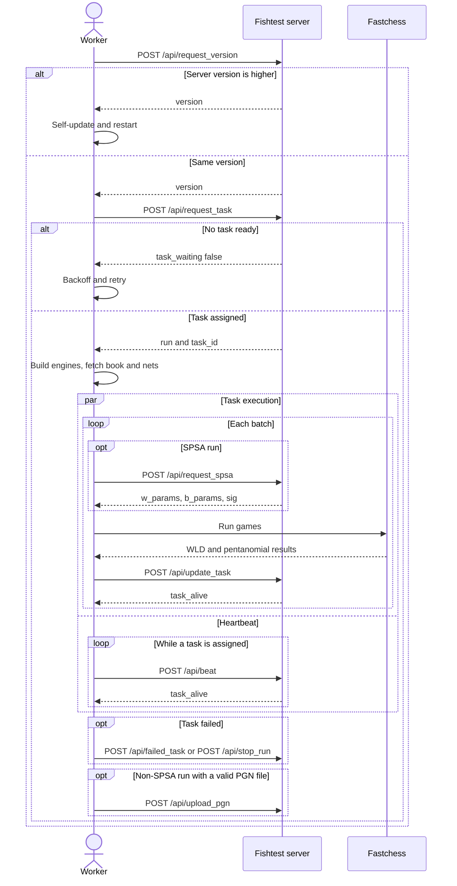

# Worker API Reference

## Scope

This page documents the HTTP surface implemented in `server/fishtest/api.py`.
It has two halves:

- nine authenticated endpoints that form the **worker protocol**, spoken by
  `worker/worker.py` and `worker/games.py`;
- eleven read-only endpoints that serve run, task, PGN, and Elo data to the
  web UI and to external tools.

Every route is registered on the `router` object in `server/fishtest/api.py`
and mounted by `server/fishtest/app.py` -> `create_app()`. There are no
`/api/*` routes outside `api.py`.

For the client side of the same contract, see
[6-worker.md](6-worker.md). For the async/threadpool rules that every handler
follows, see [2-threading-model.md](2-threading-model.md).

## Endpoint index

### Worker protocol (authenticated)

The set is frozen in `WORKER_API_PATHS` in `server/fishtest/api.py`.

| Path | Method | Route -> handler (`api.py`) | Work performed by | Request schema |
|------|--------|------------------------------|-------------------|----------------|
| `/api/request_version` | POST | `api_request_version` -> `WorkerApi.request_version` | returns `api.WORKER_VERSION` | `api_access_schema` |
| `/api/request_task` | POST | `api_request_task` -> `WorkerApi.request_task` | `rundb.RunDb.request_task` -> `RunDb.sync_request_task` | `api_schema` |
| `/api/update_task` | POST | `api_update_task` -> `WorkerApi.update_task` | `rundb.RunDb.update_task` -> `RunDb.sync_update_task` | `api_schema` |
| `/api/beat` | POST | `api_beat` -> `WorkerApi.beat` | in handler, under `RunDb.active_run_lock` | `api_schema` |
| `/api/request_spsa` | POST | `api_request_spsa` -> `WorkerApi.request_spsa` | `spsa_handler.SPSAHandler.request_spsa_data` | `api_schema` |
| `/api/failed_task` | POST | `api_failed_task` -> `WorkerApi.failed_task` | `rundb.RunDb.failed_task` | `api_schema` |
| `/api/stop_run` | POST | `api_stop_run` -> `WorkerApi.stop_run` | `rundb.RunDb.stop_run`, `actiondb.ActionDb.stop_run` | `api_schema` |
| `/api/upload_pgn` | POST | `api_upload_pgn` -> `WorkerApi.upload_pgn` | `rundb.RunDb.upload_pgn` | `api_schema` then `gzip_data` |
| `/api/worker_log` | POST | `api_worker_log` -> `WorkerApi.worker_log` | `actiondb.ActionDb.worker_log` | `api_schema` |

### Read-only (no authentication)

| Path | Method | Route -> handler (`api.py`) | Work performed by |
|------|--------|------------------------------|-------------------|
| `/api/active_runs` | GET | `api_active_runs` -> `UserApi.active_runs` | `RunDb.runs.find` |
| `/api/finished_runs` | GET | `api_finished_runs` -> `UserApi.finished_runs` | `rundb.RunDb.get_finished_runs` |
| `/api/actions` | POST | `api_actions` -> `UserApi.actions` | `RunDb.db["actions"].find` |
| `/api/get_run/{id}` | GET | `api_get_run` -> `UserApi.get_run` | `RunDb.get_run`, `util.strip_run` |
| `/api/get_task/{id}/{task_id}` | GET | `api_get_task` -> `UserApi.get_task` | `RunDb.get_run` |
| `/api/get_elo/{id}` | GET | `api_get_elo` -> `UserApi.get_elo` | `stats.stat_util.SPRT_elo` |
| `/api/calc_elo` | GET | `api_calc_elo` -> `UserApi.calc_elo` | `stats.stat_util.SPRT_elo`, `stats.stat_util.get_elo` |
| `/api/pgn/{id}` | GET | `api_download_pgn` -> `UserApi.download_pgn` | `rundb.RunDb.get_pgn` |
| `/api/run_pgns/{id}` | GET | `api_download_run_pgns` -> `UserApi.download_run_pgns` | `rundb.RunDb.get_run_pgns` |
| `/api/nn/{id}` | GET | `api_download_nn` -> `UserApi.download_nn` | `rundb.RunDb.get_nn`, `RunDb.increment_nn_downloads` |
| `/api/rate_limit` | GET | `api_rate_limit` -> `UserApi.rate_limit` | `github_api.rate_limit` |

`POST` is the only method registered for `/api/actions`; `OPTIONS` is not
registered on any `/api` route and returns `405`.

## Protocol invariants

These hold for the nine worker protocol endpoints.

- The request body is a JSON object. A body that is not JSON produces
  `400` with `{"error": "<path>: request is not json encoded", "duration": N}`.
- Every response body is a JSON object that contains `duration`, a float
  giving the seconds the handler spent server-side. `GenericApi.add_time()`
  stamps successful responses; the handlers in
  `server/fishtest/http/errors.py` and
  `server/fishtest/http/middleware.py` stamp the failure paths.
  `worker/games.py` -> `send_api_post_request()` reads `response["duration"]`
  unconditionally, so `duration` is mandatory, not advisory.
- `Content-Type` is `application/json` in both directions.
- The current protocol version is the integer `WORKER_VERSION` in
  `server/fishtest/api.py`. The worker carries its own copy in
  `worker/worker.py`; the two must agree, and the worker self-updates when the
  server reports a higher number. Both are `325` on this codebase.
- Two error channels exist, and they differ in status code. See
  [Error handling](#error-handling).

### Instance routing

`RejectNonPrimaryWorkerApiMiddleware` in
`server/fishtest/http/middleware.py` rejects worker protocol calls that reach
a non-primary instance with `503` and
`{"error": "<path>: primary instance required", "duration": N}`. The set it
guards is `PRIMARY_ONLY_WORKER_API_PATHS`, which is `WORKER_API_PATHS` minus
`/api/upload_pgn`; PGN upload is deliberately allowed on a secondary backend.

`ShutdownGuardMiddleware` short-circuits every request with an empty
`text/plain` `503` once `RunDb._shutdown` is set. That response is not JSON,
so a worker sees it as a failed POST rather than as a protocol error.

## Authentication and authorization

Credentials travel in two different places in the same body:

- `password` is a top-level string field;
- `worker_info.username` is the username.

`WorkerApi.validate_username_password()` validates that pair against
`api_access_schema` and then calls `userdb.UserDb.authenticate()`. Any
rejection - unknown user, wrong password, blocked account, pending account -
produces `401` with the message from `authenticate()` prefixed by the request
path. The `error_code` that `authenticate()` returns is not forwarded to the
worker.

`/api/request_version` stops there, on purpose: an outdated worker must be
able to learn that it should upgrade even if its `worker_info` no longer
satisfies the current schema. Every other worker endpoint continues through
`WorkerApi.validate_request()`, which additionally:

1. validates the whole body against `api_schema`;
2. resolves `run_id` through `RunDb.get_run()` and fails with
   `Invalid run_id: ...` when it does not exist;
3. range-checks `task_id` against `run["tasks"]`;
4. requires that the request's `worker_info.unique_key` and
   `worker_info.username` equal the values recorded on that task. This is
   what prevents one worker from writing results into another worker's task.

Server-controlled fields are injected, never trusted from the body:
`WorkerApi.worker_info()` overwrites `remote_addr` (from the connection, or
from the task for an existing task) and sets `country_code` from the
`X-Country-Code` request header, normalizing a missing value or `ZZ` to `?`.

Two further authorization rules apply:

- `/api/stop_run` requires the requesting user to have at least 1000 CPU
  hours (`WorkerApi.cpu_hours()`). An under-quota caller gets `401`, the run
  is left alone, and only the caller's task is deactivated. The attempt is
  still recorded in the action log with `(not authorized)` appended.
- `/api/request_task` enforces a per-user cap on simultaneous connections
  from one IP address, read from `userdb.UserDb.get_machine_limit()`
  (per-user `machine_limit`, otherwise `DEFAULT_MACHINE_LIMIT` in
  `server/fishtest/userdb.py`).

## Task lifecycle

Follow this call chain when tracing a task end to end. Each hop names the file
and symbol on both sides.

| Step | Worker side | Server side |
|------|-------------|-------------|
| 1. Version check | `worker.py` -> `verify_worker_version()` | `api.py` -> `WorkerApi.request_version()` |
| 2. Self-update | `updater.py` -> `update()`, `do_restart()` | -- (worker downloads from GitHub) |
| 3. Task request | `worker.py` -> `fetch_and_handle_task()` | `api.py` -> `WorkerApi.request_task()` -> `rundb.py` -> `RunDb.sync_request_task()` |
| 4. Task allocation | -- | `rundb.py` -> `RunDb.worker_cap()`, `RunDb.insert_in_wtt_map()`, `RunDb.buffer()` |
| 5. Build and stage | `games.py` -> `run_games()`, `setup_engine()`, `establish_validated_net()` | `api.py` -> `UserApi.download_nn()` for `/api/nn/{id}` |
| 6. SPSA parameters | `games.py` -> `launch_fastchess()` | `api.py` -> `WorkerApi.request_spsa()` -> `spsa_handler.py` -> `SPSAHandler.request_spsa_data()` |
| 7. Batch results | `games.py` -> `parse_fastchess_output()` | `api.py` -> `WorkerApi.update_task()` -> `rundb.py` -> `RunDb.sync_update_task()` |
| 8. SPSA aggregation | -- | `spsa_handler.py` -> `SPSAHandler.update_spsa_data()` |
| 9. Liveness | `worker.py` -> `heartbeat()` | `api.py` -> `WorkerApi.beat()` |
| 10. Failure | `worker.py` -> `fetch_and_handle_task()` exception handlers | `api.py` -> `WorkerApi.failed_task()` or `WorkerApi.stop_run()` |
| 11. PGN upload | `worker.py` -> `upload_pgn_data()` | `api.py` -> `WorkerApi.upload_pgn()` -> `rundb.py` -> `RunDb.upload_pgn()` |



## Worker protocol endpoints

Field tables list what the schema and the handler actually require. Fields
marked optional are declared with `?` in `api_schema`
(`server/fishtest/schemas.py`).

### Shared request fields

Every worker endpoint except `/api/request_version` validates against
`api_schema`:

| Field | Required | Type | Notes |
|-------|----------|------|-------|
| `password` | yes | string | Top level, not inside `worker_info` |
| `worker_info` | yes | object | Must match `worker_info_schema_api` exactly |
| `run_id` | conditional | string | 24-character ObjectId; required by every endpoint that names a task |
| `task_id` | conditional | int >= 0 | `api_schema` enforces that `task_id` implies `run_id` |
| `stats` | no | object | `results_schema` |
| `spsa` | no | object | SPSA batch counts, see `/api/update_task` |
| `message` | no | string | Truncated to `ACTION_MESSAGE_SIZE` when written to the action log |
| `pgn` | no | string | base64 of gzip data, `/api/upload_pgn` only |

`worker_info_schema_api` requires all of these keys, with no extras: `uname`,
`architecture`, `concurrency`, `max_memory`, `min_threads`, `username`,
`version`, `python_version`, `gcc_version`, `compiler`, `unique_key`,
`modified`, `worker_arch`, `ARCH`, `nps`, `near_github_api_limit`. `compiler`
must be one of `supported_compilers` and `worker_arch` one of
`supported_arches` or the literal `unknown`, both from
`server/fishtest/constants.py`.

### POST /api/request_version

Returns the protocol version the server expects.

Request: `password` and `worker_info.username` only. `api_access_schema` is
`lax`, so additional keys are accepted and the rest of `worker_info` is not
inspected.

Response:

```json
{ "version": 325, "duration": 0.001 }
```

`worker.py` -> `verify_worker_version()` triggers `updater.update()` when
`version` exceeds the worker's own `WORKER_VERSION`.

### POST /api/request_task

Asks for a task assignment. The worker sends neither `run_id` nor
`task_id`.

Response when a task is assigned:

```json
{
  "run": {
    "_id": "5f0a1b2c3d4e5f6071829304",
    "args": { "...": "run arguments, plus book_sri" },
    "my_task": {
      "num_games": 200,
      "start": 1200,
      "stats": { "wins": 0, "losses": 0, "draws": 0, "crashes": 0,
                 "time_losses": 0, "pentanomial": [0, 0, 0, 0, 0] }
    }
  },
  "task_id": 3,
  "duration": 0.05
}
```

`WorkerApi.request_task()` strips the stored run down to `_id`, `args`, and
`my_task` before returning it, and adds `args.book_sri` from `RunDb.books`
when the run's opening book is known. `my_task.start` is the opening-book
offset for this task; `my_task.stats` carries any games already played, which
is what lets a reassigned task resume.

Response when no task is handed out - always HTTP 200:

```json
{ "task_waiting": false, "duration": 0.01 }
```

`RunDb.sync_request_task()` adds an `error` or `info` key alongside
`task_waiting` to explain the refusal. The distinct causes are:

| Extra key | Cause |
|-----------|-------|
| `info` | `RunDb.task_semaphore` is exhausted; the server is admitting too many concurrent `request_task` calls |
| `error` | The worker name is blocked in `workerdb.WorkerDb`; the message contains unblock instructions |
| `error` | Another worker with the same short name updated a task less than 120 seconds ago |
| `error` | The user's machine limit for this IP address is reached |
| (none) | No unfinished run matches this worker |
| `info` | The selected run stopped needing games between selection and assignment |

Run selection in `RunDb.sync_request_task()` skips a run when the worker has
too few or too many threads, when the run has no games left uncommitted, when
`max_memory` cannot cover hash plus engine overhead, when the run's
`arch_filter` does not match `worker_info.worker_arch`, when the run's
`compiler` differs from `worker_info.compiler`, or when
`worker_info.near_github_api_limit` is true and the worker has not built this
run's binaries before.

### POST /api/update_task

Reports cumulative game results for a task. Requires `run_id` and `task_id`.

| Field | Required | Notes |
|-------|----------|-------|
| `stats` | yes | Optional in `api_schema`, but `RunDb.sync_update_task()` reads the counters unconditionally, so omitting it yields a `500` |
| `stats.wins`, `stats.losses`, `stats.draws` | yes | Cumulative for the whole task, not per batch |
| `stats.crashes`, `stats.time_losses` | yes | Cumulative counters |
| `stats.pentanomial` | yes | Five non-negative ints |
| `spsa` | SPSA runs only | `{"wins", "losses", "draws", "num_games", "sig"}`; `num_games` must be even and equal to `wins + losses + draws` |

`results_schema` also enforces arithmetic consistency through
`valid_results()`: the WLD total must equal twice the pentanomial total, the
win/loss difference must match the pentanomial weights, and the draw count
must lie inside the range the pentanomial allows. A body that violates this
is a `400` validation error, not an application error.

Response:

```json
{ "task_alive": true, "duration": 0.02 }
```

`task_alive` is false when the task is no longer active, when the run just
finished or was stopped, or when `RunDb.sync_update_task()` rejected the
update. In the rejection cases the body also carries `info` or `error` and
the task is deactivated. `sync_update_task()` rejects an update that reports
fewer games than before, an odd number of new games, or - on an SPRT run - a
game count that is not a multiple of twice `args.sprt.batch_size`.

### POST /api/beat

Keeps the task lease alive. Requires `run_id` and `task_id`.

Response:

```json
{ "task_alive": true, "duration": 0.001 }
```

The handler refreshes `task["last_updated"]` only while the task is active,
and returns the task's `active` flag. `rundb.py` ->
`RunDb.scavenge_dead_tasks()`, scheduled periodically from
`RunDb.schedule_tasks()`, deactivates active tasks whose `last_updated` has
gone stale, which is how a worker that stopped beating loses its task.
`/api/update_task` refreshes the same field, so a worker that is reporting
results keeps its lease even without a heartbeat.

### POST /api/request_spsa

Fetches the SPSA parameter perturbation for the next batch. Requires `run_id`
and `task_id`. The worker sends the same body it uses for `/api/update_task`.

Response:

```json
{
  "w_params": [{ "name": "P", "value": 12.3, "c": 4.5, "R": 0.001, "flip": 1 }],
  "b_params": [{ "name": "P", "value": 3.7 }],
  "sig": 2743129873,
  "task_alive": true,
  "duration": 0.01
}
```

`w_params` entries carry the fields built by
`spsa_workflow.build_spsa_worker_step()` (`c`, `R`, `flip`) plus `name` and
the clipped `value`; `b_params` entries carry `name` and `value` only. `sig`
is a CRC32 over the packed flip vector stored on the task. The worker echoes
it back in `spsa.sig` on the next `/api/update_task`;
`SPSAHandler.update_spsa_data()` discards the update when the signature does
not match, which is what protects the tune from a server restart or a worker
bug.

When the task is no longer active the response is
`{"task_alive": false, "info": "...", "duration": N}` and `w_params` is
absent.

### POST /api/failed_task

Reports that the worker could not finish the task. Requires `run_id` and
`task_id`; `message` is optional and is truncated to `ACTION_MESSAGE_SIZE`
when written to the action log.

Response is `{"duration": N}` on success, or
`{"task_alive": false, "info": "...", "duration": N}` when the task was
already inactive. The handler deactivates the task, records a `failed_task`
action, and records a `crash_or_time` action when the task's crash or
time-loss rate is excessive.

### POST /api/stop_run

Asks the server to stop the whole run. Requires `run_id` and `task_id`;
`message` is optional.

The worker sends this only for a `RunException`, that is, when the failure is
attributable to the run rather than to the machine - a bad engine option, an
illegal move, or a failed bench signature.

Response is `{"duration": N}` when the run was stopped. Failure modes:

| Status | Condition |
|--------|-----------|
| `401` | Caller has fewer than 1000 CPU hours; the run is untouched and only the caller's task is deactivated |
| `401` | The run is already finished |

### POST /api/upload_pgn

Stores the compressed PGN of a finished task. Requires `run_id`, `task_id`,
and `pgn`.

`pgn` is the base64 encoding of a gzip stream. `WorkerApi.upload_pgn()`
base64-decodes it and validates the bytes against the `gzip_data` schema;
either step failing is a `400`. The record is filed under the composite key
`"{run_id}-{task_id}"`, which is the same key `/api/pgn/{id}` reads back.

Response: `{"duration": N}`.

This is the one worker endpoint excluded from
`PRIMARY_ONLY_WORKER_API_PATHS`, so it may be served by a non-primary
instance.

### POST /api/worker_log

Writes a `worker_log` action to the server's event log. Requires `message`.

`run_id` is optional, but supplying it without `task_id` is rejected with
`400` and `Missing task_id for worker_log run context`. When both are present,
`validate_request()` has already confirmed that the caller owns that task, so
the log entry can be attributed to a specific run and task.

The message is truncated to `ACTION_MESSAGE_SIZE` (`server/fishtest/schemas.py`).

Response: `{"duration": N}`.

`worker/games.py` -> `post_to_worker_log()` is the only caller; it reports
fastchess warnings that may indicate a failing machine, with an exponential
backoff on repeats so one sick worker cannot flood the log.

## Error handling

Worker protocol failures arrive through two distinct channels. Client code
must handle both.

### Channel 1: HTTP error status with a JSON error body

`GenericApi.handle_error()` raises `HTTPException` with a dict detail, which
`server/fishtest/http/errors.py` -> `_http_exception_handler()` returns
verbatim:

```json
{
  "error": "/api/update_task: Invalid run_id: 5f0a1b2c3d4e5f6071829304",
  "duration": 0.001
}
```

The error string is always prefixed with the request path.

| Status | Raised for |
|--------|------------|
| `400` | Default for `handle_error()`: malformed JSON, schema validation failure, unknown `run_id`, out-of-range `task_id`, `worker_info` mismatch, missing `pgn`, bad base64 or non-gzip PGN |
| `400` | FastAPI request validation failure on a worker path, shaped as `{"error": "<path>: invalid request", "duration": N}` by `_request_validation_handler()` |
| `401` | Authentication failure, and the two `/api/stop_run` authorization failures |
| `404` | Read-only endpoints only, for a missing run, task, network, or PGN |
| `500` | Unhandled exception on a worker path, shaped as `{"error": "<path>: Internal Server Error", "duration": N}` by `_unhandled_exception_handler()` |
| `503` | Worker path reached a non-primary instance, or the instance is shutting down |

### Channel 2: HTTP 200 with an `error` or `info` key

`RunDb` reports operational refusals inside the result dict rather than by
raising. These arrive with status `200`:

- `/api/request_task` with `task_waiting: false` plus `error` (blocked worker,
  duplicate worker name, machine limit) or `info` (server busy, run no longer
  needs games);
- `/api/update_task`, `/api/failed_task`, and `/api/request_spsa` with
  `task_alive: false` plus `error` or `info`.

`worker/games.py` -> `send_api_post_request()` does not inspect the status
code at all: it parses the JSON body and treats a present `error` key as a
failure regardless of status. Any new error path must therefore put its
message under `error` and must include `duration`.

## Read-only endpoints

These endpoints require no credentials and do not include `duration` on
success. Errors raised from them still go through `handle_error()` and so do
carry `duration`.

### GET /api/active_runs

Returns every unfinished run as a JSON object keyed by run id. The projection
drops `tasks`, `bad_tasks`, and `args.spsa.param_history`. `_id`,
`start_time`, and `last_updated` are stringified.

### GET /api/finished_runs

Returns one page of finished, non-deleted runs, keyed by run id, sorted by
`last_updated` descending. The page size is fixed at 50 in
`UserApi.finished_runs()`. The same projection as `/api/active_runs` applies.

| Parameter | Type | Description |
|-----------|------|-------------|
| `page` | int, required | 1-based page number; missing or non-positive gives `400` |
| `username` | string | Exact match on `args.username` |
| `success_only` | any non-empty value | Restrict to green runs |
| `yellow_only` | any non-empty value | Restrict to yellow runs |
| `ltc_only` | any non-empty value | Restrict to long time control runs |
| `timestamp` | string | UNIX timestamp, 10 digits with optional fraction; acts as a `last_updated >= t` lower bound. Any other format gives `400` |

The boolean-looking parameters are read as raw query strings, so any non-empty
value enables the filter.

### POST /api/actions

Returns at most 200 action-log documents matching the JSON object in the
request body, used directly as a MongoDB query. A body that is not JSON
yields an empty list rather than an error. The response is a JSON
**array**, not an object. `access-control-allow-origin: *` and
`access-control-allow-headers: content-type` are set on the response;
`OPTIONS` preflight is not registered and returns `405`.

### GET /api/get_run/{id}

Returns one run document via `util.strip_run()`. `strip_run()` replaces
`tasks` and `bad_tasks` with empty lists and `args.spsa.param_history` with an
empty list, so no per-worker data is exposed here. A missing run gives `404`.
The same two CORS response headers as `/api/actions` are set.

### GET /api/get_task/{id}/{task_id}

Returns one task document. Append `bad` to the task id
(`/api/get_task/{id}/3bad`) to read from `bad_tasks` instead of `tasks`.

The document is sanitized: `worker_info.unique_key` is cut to its first eight
characters followed by `...`, `worker_info.remote_addr` is replaced with
`?.?.?.?`, `last_updated` is stringified, an infinite `residual` becomes the
string `inf`, and `spsa_params.packed_flips` becomes a list of byte values.
Anything that does not resolve gives `404`.

### GET /api/get_elo/{id}

Returns the stripped run plus an `elo` object computed by `SPRT_elo()`.
Returns `{}` when the run has no `args.sprt`. A missing run gives `404`.

### GET /api/calc_elo

Computes Elo from counts supplied as query parameters. Pentanomial input wins
when both forms are present and valid.

| Parameter | Type | Description |
|-----------|------|-------------|
| `LL`, `LD`, `DDWL`, `WD`, `WW` | int >= 0 | Pentanomial counts |
| `W`, `D`, `L` | int >= 0 | Trinomial counts, used only if the pentanomial set is incomplete |
| `elo0`, `elo1` | float | SPRT bounds; supplying both switches the response to SPRT form |
| `elo_model` | string | `BayesElo`, `logistic`, or `normalized`; default `normalized` |

Without `elo0` and `elo1` the response is
`{"elo": ..., "ci": [lower, upper], "LOS": ...}`. With both, the response is
whatever `SPRT_elo()` returns, computed at alpha = beta = 0.05. Errors
(`400`): no games, a game count above 2^32, unparsable counts, `elo1` less
than `elo0 + 0.5`, either bound outside +/- 10, or an unknown `elo_model`.

### GET /api/nn/{id}

Returns a `302` redirect to `{FISHTEST_NN_URL}/nn/{id}`, falling back to the
current scheme and host when `FISHTEST_NN_URL` is unset, and increments the
network's download counter. A missing network gives `404`. The worker follows
this redirect in `worker/games.py` -> `fetch_validated_net()`.

### GET /api/pgn/{id}

Streams the gzip-compressed PGN of one task. `{id}` is
`{run_id}-{task_id}.pgn`; everything from the first `.` is stripped to form
the lookup key. The response is a `StreamingResponse` with media type
`application/gzip`, `Content-Encoding: gzip`, `Content-Length`, and a
`Content-Disposition` attachment filename. No data gives `404`.

### GET /api/run_pgns/{id}

Streams every task PGN of a run concatenated in `task_id` order. `{id}` must
match `^([a-zA-Z0-9]+)\.pgn\.gz$` exactly; anything else gives `400`. The
response is a `StreamingResponse` with media type `application/gzip`,
`Content-Length`, and a `Content-Disposition` attachment filename. Note that
`Content-Encoding` is not set here, so the client receives the archive as
bytes. No data gives `404`.

### GET /api/rate_limit

Returns the server's cached view of the GitHub API rate limit:
`limit`, `remaining`, `reset`, `used`, `resource`, and the internal
`_uninitialized` flag. Backed by `server/fishtest/github_api.py` ->
`rate_limit()`.

## Validation

Request bodies are validated with vtjson. The relevant symbols live in
`server/fishtest/schemas.py`:

| Symbol | Applies to | Purpose |
|--------|-----------|---------|
| `api_access_schema` | all worker endpoints | `lax` check of `password` and `worker_info.username` |
| `api_schema` | all worker endpoints except `/api/request_version` | Full body shape, including `ifthen(keys("task_id"), keys("run_id"))` |
| `worker_info_schema_api` | nested in `api_schema` | Exact key set of `worker_info` |
| `results_schema` | `stats` | Counter types plus the `valid_results()` arithmetic invariant |
| `gzip_data` | `/api/upload_pgn` | Magic-byte check that the decoded payload is gzip |
| `pgns_schema` | `RunDb.upload_pgn()` | Stored PGN record; a violation is logged, not returned |
| `runs_schema` | `RunDb.stop_run()` | Stored run document; a violation is logged, not returned |

Schema failures on a request produce `400`. Schema failures on a document the
server is about to store are logged to the action log under
`fishtest.system` and do not fail the request.

## Adding a worker API endpoint

1. Add the route in `server/fishtest/api.py` with `@router.post(...)` or
   `@router.get(...)`.
2. Write the route as `async def`, build a `WorkerApi` or `UserApi` from
   `get_request_shim(request)` (or `ApiRequestShim(request)` for endpoints
   that do not read a JSON body), and run the blocking body through
   `run_in_threadpool`.
3. Call `self.validate_request()` first in any authenticated handler.
4. Return a dict wrapped in `GenericApi.add_time()` so the response carries
   `duration`.
5. Signal errors with `GenericApi.handle_error()`, passing an explicit
   `status_code` when `400` is wrong.
6. Extend the schemas in `server/fishtest/schemas.py` if the endpoint accepts
   new structured input.
7. Add the path to `WORKER_API_PATHS` in `server/fishtest/api.py` so the
   non-primary guard, the validation-error handler, and the unhandled-exception
   handler all keep the worker protocol shape.
8. Add a contract test in `server/tests/test_api.py`.

## Related references

- [1-architecture.md](1-architecture.md) - module map, middleware stack,
  primary and secondary instances.
- [2-threading-model.md](2-threading-model.md) - why every handler body runs
  in the threadpool.
- [6-worker.md](6-worker.md) - the client that consumes this API.
