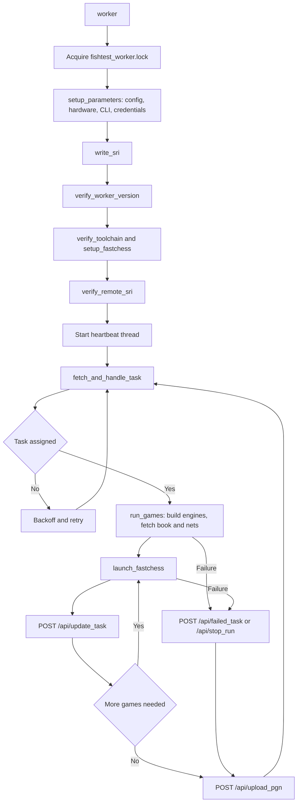

# Worker architecture

## Scope

The worker is the standalone client that volunteers run on their own
machines. It authenticates against a fishtest server, asks for a task,
compiles Stockfish from source, plays games with fastchess, and reports
results back over the worker API.

This page documents the worker as it is implemented in `worker/`. For the
server side of the same contract - endpoint payloads, status codes, and error
shapes - see [3-api-reference.md](3-api-reference.md).

The worker targets Python >= 3.8 (`worker/pyproject.toml`), which is older
than the server's Python >= 3.14, so that it keeps running on contributor
machines with long-lived distributions.

## Source map

| File | Purpose |
|------|---------|
| `worker/worker.py` | Entry point, configuration, credentials, toolchain checks, main loop, heartbeat, signal handling |
| `worker/games.py` | HTTP helpers, downloads, engine compilation, fastchess launch and output parsing, file trimming |
| `worker/updater.py` | Self-update and process restart |
| `worker/fishtest.cfg` | Persistent configuration written back on every start |
| `worker/sri.txt` | Subresource-integrity hashes of the worker source files |
| `worker/packages/` | Vendored `requests`, `openlock`, `expression`, and their dependencies, used when the real packages are not installed |
| `worker/tests/test_worker.py` | Worker unit tests, including the `sri.txt` check |

## Constants

Declared at the top of `worker/worker.py` and `worker/games.py`.

| Constant | Value | Location | Meaning |
|----------|-------|----------|---------|
| `WORKER_VERSION` | 325 | `worker.py` | Protocol version; must equal `WORKER_VERSION` in `server/fishtest/api.py` |
| `FASTCHESS_SHA` | `58072f231dc1ae33204254f867afd0a195f21a2e` | `worker.py` | The exact fastchess commit the worker builds and verifies |
| `FILE_LIST` | `updater.py`, `worker.py`, `games.py` | `worker.py` | Files covered by `sri.txt` |
| `HTTP_TIMEOUT` | 30.0 s | `worker.py`, `games.py` | Default timeout for every HTTP call |
| `INITIAL_RETRY_TIME` | 15.0 s | `worker.py` | First backoff delay in the main loop |
| `MAX_RETRY_TIME` | 900.0 s | `worker.py` | Backoff ceiling |
| `THREAD_JOIN_TIMEOUT` | 15.0 s | `worker.py` | Wait for the heartbeat thread on shutdown |
| `MIN_GCC_MAJOR`.`MIN_GCC_MINOR` | 9.3 | `worker.py` | Oldest accepted g++ |
| `MIN_CLANG_MAJOR`.`MIN_CLANG_MINOR` | 11.0 | `worker.py` | Oldest accepted clang++ |
| `UPDATE_RETRY_TIME` | 15.0 s | `games.py` | Delay between failed `/api/update_task` and network-fetch retries |
| `FASTCHESS_KILL_TIMEOUT` | 15.0 s | `games.py` | Grace period after SIGINT before fastchess is killed |
| `LOGFILE` | `api.log` | `games.py` | API latency log in the worker directory |

## Control flow



### `worker()` - entry point

1. Acquire the `fishtest_worker.lock` file lock, so only one worker runs per
   directory. A second instance prints the holder's PID and exits with 1.
2. Create the `testing/` directory if it is missing.
3. Install signal handlers for SIGINT, SIGTERM, SIGQUIT, and SIGBREAK.
4. Call `setup_parameters()`: read `fishtest.cfg`, probe memory, CPU count,
   and compilers, apply CLI overrides, resolve credentials, and write the
   config back.
5. Call `write_sri()` to regenerate `sri.txt` from the current source files.
6. Exit with 0 if `--only_config` was given.
7. Call `verify_worker_version()`, which may trigger a self-update and never
   return.
8. Call `verify_toolchain()` to confirm `make` and `strip` work.
9. Call `setup_fastchess()`, which builds and self-tests fastchess when the
   cached binary is missing or has the wrong commit.
10. Call `verify_remote_sri()` to compare the local hashes against
    `worker/sri.txt` on the fishtest master branch. A network failure here is
    fatal; a mismatch only sets `worker_info["modified"]`.
11. Assemble the `worker_info` dictionary sent with every API request.
12. Start the heartbeat thread as a daemon.
13. Run the main loop until `current_state["alive"]` goes false.

Once the main loop is entered, `worker()` returns 0 only when it stopped
because of the `fish.exit` file. Every other exit from the loop returns 1.

### `fetch_and_handle_task()`

This function is written not to raise; it signals trouble by returning
`False` and requests an immediate exit by setting `current_state["alive"]`
to false.

1. Re-verify the worker version, which may self-update and restart.
2. Call `trim_files()` on `testing/` to delete stale downloads and binaries.
3. Query `https://api.github.com/rate_limit`. Ten or fewer remaining calls
   sets `worker_info["near_github_api_limit"]`, which makes the server offer
   only runs whose binaries this worker has already built.
4. POST `/api/request_task`. Return `False` on an `error` key or on
   `task_waiting`.
5. Call `games.run_games()` with the assigned run and task.
6. Map the outcome onto an endpoint: success reports nothing;
   `RunException` posts `/api/stop_run`; every other exception posts
   `/api/failed_task`. `FatalException` and unexpected exceptions also clear
   `current_state["alive"]`.
7. Upload the PGN with `/api/upload_pgn` when the run is not an SPSA tune,
   the PGN file exists and is non-empty, and its CRC32 matches the value
   fastchess reported. This runs on the failure path too, so partial results
   are not lost.

### `run_games()`

Implemented in `worker/games.py`. It is expected to raise on any condition
that makes the task impossible.

1. Seed `result["stats"]` from `my_task.stats` so a reassigned task resumes
   instead of replaying games.
2. Download and verify the opening book against `args.book_sri`, retrying
   once through a fresh download.
3. Build the `new` and `base` engines with `setup_engine()`.
4. Fetch every network the engines reference with
   `establish_validated_net()`.
5. Verify the bench signature of each engine and measure nodes per second.
   A signature mismatch raises `RunException`, which stops the run for
   everybody.
6. Derive the CPU scaling factor from the measured nps and scale the time
   control with `adjust_tc()`.
7. Raise `FatalException` when the machine is slower than the minimum nps the
   worker requires for its concurrency, which shuts the worker down rather
   than failing task after task.
8. Build the fastchess command line, including opening book selection,
   adjudication, the Chess960 variant when the book name contains `FRC` or
   `960`, and `_spsa_` placeholders for the tuned options.
9. Loop over batches, calling `launch_fastchess()` once per batch for SPSA
   tunes and once for the whole task otherwise.

The batch size is derived from the games concurrency and the scaled time
control, so short time controls report more often in wall-clock terms. For
SPRT runs it is replaced by twice `args.sprt.batch_size`, which is what makes
the server's SPRT update arithmetic valid.

### `launch_fastchess()`

1. For an SPSA run, POST `/api/request_spsa` and abort the batch if the
   server reports `task_alive: false`.
2. Substitute the `_spsa_` placeholders with `option.<name>=<value>` for the
   white and black parameter sets, applying stochastic rounding so the integer
   options average out to the requested float values.
3. Start fastchess as a subprocess, hidden and in its own console on Windows
   so it can be sent a Ctrl-C event.
4. Hand the process to `parse_fastchess_output()`.
5. On any exit, send SIGINT to fastchess and wait `FASTCHESS_KILL_TIMEOUT`
   for it to stop; kill the process tree if it does not.

### `parse_fastchess_output()`

1. Drain fastchess stdout and stderr through two daemon threads into a
   queue.
2. Parse the `Games: ... Wins: ... Losses: ... Draws: ...` and
   `Ptnml(0-2): [...]` lines into cumulative WLD and pentanomial counts.
3. Count crashes from `disconnect` and `stall` lines and time losses from
   `on time` and `timeout` lines.
4. Treat a match on any fastchess error pattern - an unknown or rejected
   engine option, an illegal move, a broken PV - as a `RunException`, unless
   the engine name belongs to an official Stockfish release.
5. Report fastchess warnings that suggest a sick machine to
   `/api/worker_log`, posting the first occurrence per pattern and engine and
   then only on exponentially spaced repeats.
6. POST `/api/update_task` when a batch fills or the task's games are all
   played. Failed updates are retried up to five times, `UPDATE_RETRY_TIME`
   apart; exhausting them raises `WorkerException`. A response with
   `task_alive: false` ends the task cleanly.
7. Abort with `WorkerException` when the `fish.exit` file appears, checked
   after every successful update.
8. Abort with `WorkerException` when the wall-clock limit derived from the
   scaled time control passes, and with `WorkerException` when fastchess
   exits non-zero or reports a match that finished with the wrong number of
   games.

## Heartbeat

`worker.py` -> `heartbeat()` runs as a daemon thread for the worker's whole
lifetime. It wakes every second and posts `/api/beat` only when 120 seconds
have passed since the last contact with the server, and only when a run and
task are currently assigned. Both the heartbeat itself and a successful
`/api/update_task` refresh that timer, so a worker producing results does not
also produce heartbeats.

If the server answers `task_alive: false`, or returns an `error`, the thread
clears `current_state["run"]` and `current_state["task_id"]`, which makes
`parse_fastchess_output()` abandon the current batch.

## Retry and backoff

The main loop in `worker()` keeps a `delay`, initialized to
`INITIAL_RETRY_TIME`.

- `fetch_and_handle_task()` returning `True` resets `delay` to
  `INITIAL_RETRY_TIME`.
- Returning `False` - an error, or simply no task available - sleeps `delay`
  and then doubles it, capped at `MAX_RETRY_TIME`.

This is the backoff the server relies on when it refuses `request_task` under
load.

## Signal handling and shutdown

| Signal | Behavior |
|--------|----------|
| SIGINT | `on_sigint()` sets `current_state["alive"] = False` and raises `FatalException` |
| SIGTERM | Same as SIGINT |
| SIGQUIT | Same as SIGINT; not installed on Windows |
| SIGBREAK | Same as SIGINT; only present on Windows |

The `fish.exit` file in the worker directory is the graceful alternative.
`parse_fastchess_output()` notices it after the next successful task update
and raises `WorkerException`, so the task is reported as failed rather than
abandoned silently; the main loop then deletes the file, releases the lock,
joins the heartbeat thread, and exits with 0.

## Configuration file

`worker/fishtest.cfg`, INI format, read and rewritten by `ConfigParser` on
every start. Unknown sections and options are removed, and an option whose
value does not parse is replaced by its default.

```ini
[login]
username = myuser
password = mypassword

[parameters]
protocol = https                          ; http or https
host = tests.stockfishchess.org
port = 443
concurrency = max(1,min(3,MAX-1))         ; expression, MAX = cpu count
max_memory = MAX/2                        ; expression, MAX = total RAM in MiB
uuid_prefix = _hw                         ; _hw, or an alphanumeric prefix (>= 2 chars, cut to 8)
min_threads = 1                           ; do not accept tasks with fewer threads
fleet = False                             ; True = quit on error or empty queue
global_cache =                            ; shared cache path for multi-worker setups
compiler = g++                            ; one of the detected compilers

[private]
hw_seed = 3418512882                      ; random seed for the hardware UUID prefix
```

`concurrency` and `max_memory` are expressions evaluated at startup with
`MAX` bound to the CPU count and to the total RAM in MiB respectively, and
with `min` and `max` available as functions. The worker writes the evaluated
result back as an inline comment.

Two adjustments happen after parsing and are also written back:

- `concurrency` is reduced if the requested value cannot run an STC test
  inside `max_memory`. If even one core does not fit, the worker refuses to
  start.
- `port` is rewritten to 80 when `protocol` is `http` and the port is still
  443, and to 443 when `protocol` is `https` and the port is still 80.

The default `compiler` is `g++` when it is detected, otherwise the first
compiler found. If no usable compiler is found the worker refuses to start.

## Command line flags

Usage: `python worker.py [USERNAME PASSWORD] [OPTIONS]`

The two positional arguments override the stored credentials. Passing any
other number of positional arguments is an error. Every option defaults to the
current value in `fishtest.cfg`, and the value used is written back to the
config file.

| Flag | Short | Type | Config default | Description |
|------|-------|------|----------------|-------------|
| `--protocol` | `-P` | `{http,https}` | `https` | Protocol used to reach the server |
| `--host` | `-n` | string | `tests.stockfishchess.org` | Server hostname |
| `--port` | `-p` | int | `443` | Server port |
| `--concurrency` | `-c` | expression | `max(1,min(3,MAX-1))` | Maximum cores to use, `MAX` = CPU count |
| `--max_memory` | `-m` | expression | `MAX/2` | Maximum memory in MiB, `MAX` = total RAM |
| `--uuid_prefix` | `-u` | string | `_hw` | UUID prefix; `_hw` derives it from the hardware |
| `--min_threads` | `-t` | int | `1` | Refuse tasks with fewer threads |
| `--fleet` | `-f` | `{False,True}` | `False` | Quit on error or when no task is available |
| `--global_cache` | `-g` | path | (empty) | Absolute path to a shared download cache |
| `--compiler` | `-C` | detected compilers | `g++` | Compiler used for engine builds |
| `--only_config` | `-w` | flag | -- | Write the config and `sri.txt`, then exit |
| `--no_validation` | `-v` | flag | -- | Skip the credential check against the server |

`--concurrency MAX` is the only way to request every core; without the literal
`MAX` in the expression the worker caps the value at one below the CPU count.

## Self-update

`verify_worker_version()` posts `/api/request_version` on startup and again at
the top of every main-loop iteration. When the server reports a version higher
than the worker's own `WORKER_VERSION`, the worker backs up `api.log`,
releases its file lock, and calls `updater.update()`:

1. Download `https://github.com/official-stockfish/fishtest/archive/master.zip`.
2. Extract it to a temporary directory inside the worker directory and locate
   its `worker/` subdirectory.
3. Run `worker.verify_sri()` against the downloaded files. A mismatch aborts
   the update.
4. Delete the local `packages/` directory, then copy the downloaded worker
   files over the installation.
5. Rename `testing/` to `_testing_<timestamp>`, create a fresh `testing/`, and
   migrate the files worth keeping with `trim_files()`. Only the three most
   recent `_testing_*` backups are kept.
6. Call `do_restart()`, which replaces the process with `os.execv()` using the
   original interpreter and arguments.

If any step fails the worker prints the failure and exits, so the next start
retries the update.

## Engine build pipeline

`games.py` -> `setup_engine()` builds one engine for a given commit SHA.

The cache key is the file name
`stockfish-<sha>-<compiler>_<major>_<minor>_<patch>-<env_hash>`, where
`env_hash` covers the build environment that `create_environment()` pins.
A binary built for a non-`native` architecture also carries an `-old` suffix.

1. Return a cached binary if it exists and passes a short bench
   (`engine_is_healthy()`); delete it if the bench fails.
2. Download the source zipball from the run's `tests_repo`, or read it from
   the global cache, and unzip it into a temporary directory.
3. Fetch the default networks named in the sources and copy them into the
   build directory.
4. Choose the build architecture with `find_arch()`, which prefers the
   Makefile's `native` target and otherwise matches CPU flags against the
   available targets.
5. Run `make -j<concurrency> profile-build`, or `make build` on Apple
   Silicon, then `make strip`.
6. Move the binary into `testing/` under its cache name. Finding the target
   name already taken raises `FatalException`, because that means another
   worker is running in the same directory.

Failures during `make strip` are fatal; failures during the build are
`WorkerException` and only fail the task.

## Compiler and toolchain detection

`detect_compilers()` probes `g++` and `clang++` by running each with
`-E -dM -` and reading the version macros. A compiler is rejected when:

- g++ is older than `MIN_GCC_MAJOR.MIN_GCC_MINOR`;
- clang++ is older than `MIN_CLANG_MAJOR.MIN_CLANG_MINOR`;
- `g++` is actually clang in disguise, detected by `__clang_major__`;
- clang++ is present but `llvm-profdata` is not, which would break the
  profile-guided build.

`verify_toolchain()` separately confirms that `make` and `strip` run. On
macOS `strip` is probed with `which` instead.

## fastchess setup

`setup_fastchess()` guarantees that `testing/fastchess` is the binary built
from `FASTCHESS_SHA`.

1. If the binary exists, run `fastchess --version` and check that the short
   SHA it prints is a prefix of `FASTCHESS_SHA`. Delete it on mismatch.
2. Otherwise download the zipball for that commit from the GitHub API, or
   read it from the global cache.
3. On the first start, build and run the fastchess test binary before
   building fastchess itself, so a broken toolchain is caught early.
4. Build with `make CXX=<compiler> GIT_SHA=<first 8 chars> GIT_DATE=01010101`
   and move the result into `testing/`.
5. Verify the version of the freshly built binary before returning.

## UUID generation

Each worker instance identifies itself with
`worker_info["unique_key"]`, built as `uuid_prefix[:8] + str(uuid4())[8:]`.

With the default `uuid_prefix = _hw`, the prefix is the 8-hex-digit value
`hw_seed XOR fingerprint(machine_id) XOR fingerprint(worker_path)`, so two
workers in different directories on the same machine get different prefixes
and the same worker keeps its prefix across restarts. `hw_seed` is the random
integer stored in the `[private]` section of `fishtest.cfg`.

`get_machine_id()` reads, in order of platform:

| Platform | Source |
|----------|--------|
| Windows | `HKEY_LOCAL_MACHINE\SOFTWARE\Microsoft\Cryptography\MachineGuid` |
| macOS | `ioreg -rd1 -c IOPlatformExpertDevice` |
| POSIX | `/etc/machine-id`, then `/var/lib/dbus/machine-id` |

An unobtainable machine id degrades to the empty string, which still yields a
stable prefix from the worker path alone.

The server derives the human-readable worker name from `username`,
`concurrency`, and the first fields of `unique_key`
(`server/fishtest/util.py` -> `worker_name()`), and appends `*` when
`worker_info["modified"]` is set.

## Fleet mode

With `fleet = True` the worker exits as soon as `fetch_and_handle_task()`
returns `False`, that is, on an error, on an unreachable server, or simply
when no task is available. This lets a fleet orchestrator scale workers with
queue depth instead of leaving idle processes polling.

## Global cache

When `global_cache` points at an existing directory, workers sharing a
machine reuse downloaded artifacts: engine source zipballs, the fastchess
zipball, and neural networks. `cache_write()` writes to a temporary file,
fsyncs it, and then links it into place, so a partially written file is never
visible. `fetch_validated_net()` hashes every cached network before use and
calls `cache_remove()` on a mismatch.

An empty `global_cache` disables caching entirely.

## File management

`trim_files()` runs on `testing/` before every task, and again during a
self-update with the pre-update directory as the source.

| Pattern | Copies kept | Expiration | Notes |
|---------|-------------|------------|-------|
| `fastchess` | 1 | never | Suffixed with `.exe` on Windows |
| `stockfish-*-old` | 0 | immediate | Only during a self-update |
| `stockfish-*` | 50 | 30 days | |
| `nn-*.nnue` | 10 | 30 days | |
| `results-*.pgn` | 10 | 30 days | |
| `*.epd` | 4 | 365 days | Opening books |
| `*.pgn` | 4 | 365 days | Opening books |

Files are ranked by access time and the most recently used are kept. Patterns
are applied in the order above and a file matched by an earlier pattern is not
reconsidered. The worker refreshes access times itself with `update_atime()`,
because Linux updates them too lazily to be trusted.

## API endpoints used by the worker

Every fishtest POST body is JSON with a top-level `password` and a
`worker_info` object; every response is a JSON object that carries `duration`
and may carry `error`. `games.py` -> `send_api_post_request()` ignores the
HTTP status code and keys off the `error` field, so an error message is
handled the same way whether it arrives with 200, 400, or 503.

### Fishtest server

| Endpoint | Method | Phase | Called from |
|----------|--------|-------|-------------|
| `/api/request_version` | POST | Startup and every loop iteration | `worker.py` -> `verify_worker_version()`, `verify_credentials()` |
| `/api/request_task` | POST | Task fetch | `worker.py` -> `fetch_and_handle_task()` |
| `/api/nn/{id}` | GET | Task setup | `games.py` -> `fetch_validated_net()` |
| `/api/update_task` | POST | Per batch | `games.py` -> `parse_fastchess_output()` |
| `/api/request_spsa` | POST | Per SPSA batch | `games.py` -> `launch_fastchess()` |
| `/api/beat` | POST | Every 120 s of silence | `worker.py` -> `heartbeat()` |
| `/api/failed_task` | POST | Task failure | `worker.py` -> `fetch_and_handle_task()` |
| `/api/stop_run` | POST | `RunException` only | `worker.py` -> `fetch_and_handle_task()` |
| `/api/upload_pgn` | POST | Task end, non-SPSA runs | `worker.py` -> `upload_pgn_data()` |
| `/api/worker_log` | POST | On fastchess warnings | `games.py` -> `post_to_worker_log()` |

### External

| Endpoint | Method | Purpose |
|----------|--------|---------|
| `https://api.github.com/rate_limit` | GET | Remaining API quota, checked before each task fetch |
| `https://api.github.com/repos/Disservin/fastchess/zipball/{sha}` | GET | fastchess source |
| `https://api.github.com/repos/{owner}/{repo}/zipball/{sha}` | GET | Engine source from the run's `tests_repo` |
| `https://raw.githubusercontent.com/{owner}/{repo}/{branch}/{item}` | GET | Opening books, `sri.txt`, `get_native_properties.sh` |
| `https://api.github.com/repos/{owner}/{repo}/contents/{item}` | GET | Fallback for the previous row when raw content is unavailable |
| `https://github.com/official-stockfish/fishtest/archive/master.zip` | GET | Self-update payload |

`download_from_github()` tries raw content first and falls back to the GitHub
API, so ordinary downloads do not consume API quota.

## Exception hierarchy

| Exception | Effect |
|-----------|--------|
| `WorkerException` | Base class; fails the current task and reports it with `/api/failed_task` |
| `RunException` | Fails the current task and asks the server to stop the whole run with `/api/stop_run` |
| `FatalException` | Fails the current task and shuts the worker down |

`WorkerException.__new__` returns an existing `WorkerException` instance
unchanged when one is passed as the `e` argument. This is what keeps a
`FatalException` from being downgraded to a plain `WorkerException` while it
is re-wrapped on the way up the stack.

## Logging

Console output goes to stdout and stderr. In addition, `games.py` -> `log()`
appends one line per API call to `api.log` in the worker directory, recording
the server-reported and worker-measured latency:

```
2026-01-15 12:00:00+00:00 : 1.23 ms (s)  45.67 ms (w)  https://tests.stockfishchess.org/api/update_task
```

`backup_log()` rotates the file to `api.log.previous` immediately before a
self-update.

## Regenerating SRI hashes

`sri.txt` records a SHA-384 hash of `worker.py`, `games.py`, and `updater.py`,
plus the `__version` these hashes belong to. The server-side copy on the
master branch is what `verify_remote_sri()` compares against, and
`updater.update()` refuses an update whose files do not match. Any change to
those three files must ship with a regenerated `sri.txt`.

```bash
cd worker
uv run worker.py a a --only_config --no_validation
```

The two positional arguments satisfy the username and password parameters,
and `--no_validation` skips the credential check so no server is needed. The
command writes `worker/sri.txt` and exits.

This also rewrites `worker/fishtest.cfg`, including the dummy credentials.
Restore your own configuration afterwards, and do not commit the modified
`fishtest.cfg`.

## Related references

- [3-api-reference.md](3-api-reference.md) - the server side of every
  endpoint listed above.
- [7-development.md](7-development.md) - running a worker against a local
  development server.
- [1-architecture.md](1-architecture.md) - how the server allocates and
  aggregates the tasks the worker executes.
