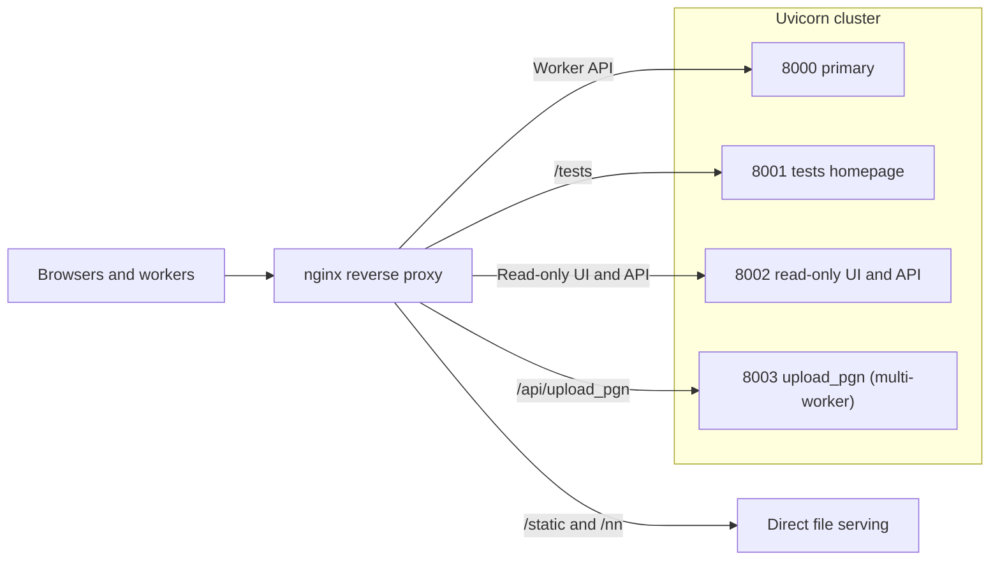

# Production Deployment

This page describes how the fishtest server is deployed: the environment
variables the process reads, the database and filesystem it expects, the
systemd units, the nginx front end, kernel and process limits, the operational
scripts in `server/utils/`, and how proxy policy relates to application
behavior. For local setup and validation workflows see
[7-development.md](7-development.md).

Sizing numbers on this page (worker-fleet targets, connection counts, file
descriptor ceilings, timeouts) describe the reference deployment of
`tests.stockfishchess.org`. They are properties of that host and its fleet, not
of the repository. Re-derive them for any other deployment.

## Prerequisites

| Component | Version | Purpose |
|-----------|---------|---------|
| Python | >= 3.14 | Runtime (`server/pyproject.toml`) |
| MongoDB | `mongod` on `localhost` | Data store; CI validates against 8.0 |
| nginx | >= 1.19.4 | Reverse proxy, TLS, static files (`ssl_reject_handshake`) |
| uv | -- | Python package manager |

## Environment variables

`Read in` paths are relative to `server/fishtest/`.

| Variable | Required | Read in | Default | Effect |
|----------|----------|---------|---------|--------|
| `FISHTEST_AUTHENTICATION_SECRET` | Yes | `http/cookie_session.py` -> `_secret_key` | -- | Session cookie signing key (itsdangerous). Startup fails without it unless `FISHTEST_INSECURE_DEV` is set |
| `FISHTEST_PORT` | Yes | `http/settings.py` -> `AppSettings.from_env` | `-1` | Port identity of this instance |
| `FISHTEST_PRIMARY_PORT` | Yes | `http/settings.py` -> `AppSettings.from_env` | `-1` | Primary port of the cluster |
| `FISHTEST_CAPTCHA_SECRET` | Yes for signup | `views.py` -> `signup` | -- | reCAPTCHA secret. Without it signup rejects every attempt with "Captcha configuration is missing" |
| `UVICORN_WORKERS` | Yes on primary | `app.py` -> `_require_single_worker_on_primary` | -- | Must be `1` on the primary; any other value raises at startup |
| `WEB_CONCURRENCY` | No | `app.py` -> `_require_single_worker_on_primary` | -- | Consulted only when `UVICORN_WORKERS` is unset or empty |
| `FISHTEST_NN_URL` | No | `api.py` -> `WorkerApi.download_nn` | request origin | Base URL that `/api/nn/{id}` redirects to (see below) |
| `FISHTEST_URL` | Recommended | `rundb.py` -> `RunDb.__init__` | `http://127.0.0.1` | Seeds `RunDb.base_url`, which is used to build run links in server log lines. When unset, `http/middleware.py` -> `AttachRequestStateMiddleware` overwrites it once from the first inbound request, so the value ends up depending on that request's `Host` and `X-Forwarded-Proto` headers. Set it explicitly to keep log links stable and predictable |
| `FISHTEST_CAPTCHA_SITE_KEY` | No | `views.py` -> `signup` | `views.py` -> `DEFAULT_RECAPTCHA_SITE_KEY` | reCAPTCHA site key rendered into the signup form |
| `FISHTEST_STATIC_DIR` | No | `http/settings.py` -> `default_static_dir` | package `static/` | Directory mounted at `/static`. In production nginx serves `/static/` first, so the mount is a fallback |
| `FISHTEST_JINJA_TEMPLATES_DIR` | No | `http/jinja.py` -> `templates_dir` | package `templates/` | Jinja2 template search path |
| `GH_TOKEN` | No | `github_api.py` -> `call` | -- | Sent as `Authorization: Bearer`. Raises the GitHub API rate limit for master-SHA refresh and book downloads |
| `OPENAPI_URL` | No | `http/settings.py` -> `AppSettings.from_env` | unset | Set to `/openapi.json` to register `/docs`, `/redoc` and `/openapi.json`. Leave unset in production |
| `FISHTEST_INSECURE_DEV` | Never in production | `http/cookie_session.py` -> `_secret_key` | -- | `1`, `true`, `yes` or `on` selects a hardcoded insecure signing secret |

`server/utils/backup.sh` and `server/utils/aws_nets_sync.py` additionally read
`VENV`, `AWS_ACCESS_KEY_ID` and `AWS_SECRET_ACCESS_KEY` from the operator's
shell profile. They are not read by the server process.

**Session invalidation**: deploying a new `FISHTEST_AUTHENTICATION_SECRET`
invalidates all existing sessions. Users must re-authenticate once.

### Primary instance detection

`AppSettings.from_env` marks the instance primary when
`FISHTEST_PORT == FISHTEST_PRIMARY_PORT`. If either value is unset or negative,
the instance defaults to primary. In a multi-instance deployment every unit
must therefore set both variables, or every process will start a scheduler.

## Database and filesystem prerequisites

| Requirement | Where the expectation comes from |
|-------------|----------------------------------|
| `mongod` reachable at `localhost` on the default port | `rundb.py` -> `RunDb.__init__` uses `MongoClient("localhost")`; there is no connection-string setting |
| Database `fishtest_new` | `util.py` -> `FISHTEST` |
| Indexes on `runs`, `pgns`, `nns`, `users`, `workers`, `actions` | `server/utils/create_indexes.py` |
| Capped `pgns` collection | `server/utils/create_pgndb.py` |
| `/var/www/fishtest/nn/` writable by the service user | `views.py` writes uploaded networks there as `nn-<hash>.nnue.gz`; the path is hardcoded |
| `/var/www/fishtest/static/` containing the contents of `server/fishtest/static/` | nginx serves `/static/`, `/robots.txt` and `/favicon.ico` from disk and never reaches the app mount |
| `/var/www/fishtest/static/html/maintenance.html` | Served by the maintenance vhost; the source file is `server/fishtest/static/html/maintenance.html` |

Refresh `/var/www/fishtest/static/` on every deploy that changes
`server/fishtest/static/`. The Jinja2 global `static_url`
(`http/jinja.py` -> `static_url`) appends a content hash query parameter
computed from the package directory, so a stale copy under `/var/www` is served
with a cache-busting token that does not match its contents.

## Primary / secondary instance model

| Instance | Port | Responsibilities |
|----------|------|------------------|
| Primary | 8000 | Scheduler, GitHub integration, aggregated data, cache flush, worker API |
| Secondary | 8001 | UI traffic (`/tests` homepage) |
| Secondary | 8002 | Read-only API, finished tests, contributors, static pages |
| Secondary | 8003 | PGN uploads (`/api/upload_pgn`), multiple Uvicorn workers |

Four systemd units cover ports 8000-8003. The primary must run a single
Uvicorn worker because it holds in-process mutable state (run cache, scheduler,
task locks); `app.py` -> `_require_single_worker_on_primary` refuses to start
otherwise. Because the primary is one async process on one core, it is the
scaling ceiling of the deployment.

Port 8003 runs several Uvicorn workers through a systemd drop-in override (see
below). Uvicorn's process manager distributes PGN upload requests across them,
which keeps the long-tail latency of large PGN writes off the shared path.

`/api/upload_pgn` is the only worker API path that a secondary instance may
serve: `api.py` defines `PRIMARY_ONLY_WORKER_API_PATHS` as `WORKER_API_PATHS`
minus `/api/upload_pgn`.

High-level routing topology:



## Starting the server

Managed via a systemd service template (one unit per port):

```bash
sudo systemctl enable fishtest@{8000..8003}
sudo systemctl start fishtest@{8000..8003}
sudo journalctl -u fishtest@8000 # useful flags: -f, --since, --until, --no-pager
```

## systemd unit template

File: `/etc/systemd/system/fishtest@.service`

Copy the following file as-is. Replace `USER_NAME` with the actual user,
`SERVER_NAME` with the actual domain, `OPTIONAL_NN_URL` with one of
the values below, and `CHANGE_ME` with the production cookie signing
secret and the reCAPTCHA secret.

`OPTIONAL_NN_URL` -- base URL that `/api/nn/{id}` redirects workers to
(`api.py` -> `WorkerApi.download_nn`):

| Value | Meaning |
|-------|---------|
| (unset) | Server falls back to the request origin (`{scheme}://{host}`) |
| (empty) | Redirect target becomes `/nn/<id>` on the same host |
| `https://SERVER_NAME` | Workers download directly from this origin |
| `https://CDN_HOSTNAME` | Workers download via a CDN in front of this origin |
| `https://data.stockfishchess.org` | Workers download via the official fishtest CDN |

Note: `systemd` `Environment="FISHTEST_NN_URL=..."` always sets the variable.
If you want the (unset) behavior, omit that `Environment=` line.

When a `CDN_HOSTNAME` is used, it must also appear in the nginx
`server_name` directive (see site configuration below). `CDN_HOSTNAME`
resolves to Cloudflare edge servers, not to the origin; Cloudflare
proxies requests back to `SERVER_NAME` and caches the immutable net
files at the edge.

```ini
[Unit]
Description=Fishtest Server port %i
After=network.target mongod.service

[Service]
Type=simple

Environment="UVICORN_WORKERS=1"
Environment="FISHTEST_URL=https://SERVER_NAME"
Environment="FISHTEST_NN_URL=OPTIONAL_NN_URL"
# Cookie-session signing secret (required in production).
# Development-only insecure fallback requires explicit opt-in: Environment="FISHTEST_INSECURE_DEV=1"
Environment="FISHTEST_AUTHENTICATION_SECRET=CHANGE_ME"
Environment="FISHTEST_CAPTCHA_SECRET=CHANGE_ME"

# Port of *this* instance
Environment="FISHTEST_PORT=%i"
# Fixed primary port for the cluster
Environment="FISHTEST_PRIMARY_PORT=8000"

WorkingDirectory=/home/USER_NAME/fishtest/server
User=USER_NAME

# Sized for the reference deployment: ~15k fds at peak, 2x headroom.
LimitNOFILE=32768

ExecStart=/home/USER_NAME/fishtest/server/.venv/bin/python -m uvicorn fishtest.app:app --host 127.0.0.1 --port %i --proxy-headers --forwarded-allow-ips=127.0.0.1 --backlog 16384 --log-level warning --workers $UVICORN_WORKERS
Restart=on-failure
RestartSec=3

[Install]
WantedBy=multi-user.target
```

`ExecStart` runs the interpreter from `server/.venv`, so the deploy step is
`cd /home/USER_NAME/fishtest/server && uv sync` before restarting the units.

### PGN upload worker override

Port 8003 handles PGN uploads, which have long-tail latency. Running several
Uvicorn workers on this port prevents slow uploads from blocking fast ones.
Create a per-instance drop-in override:

```bash
sudo mkdir -p /etc/systemd/system/fishtest@8003.service.d
```

Create the file
`/etc/systemd/system/fishtest@8003.service.d/override.conf`:

```ini
[Service]
Environment="UVICORN_WORKERS=3"
```

Then reload and restart:

```bash
sudo systemctl daemon-reload
sudo systemctl restart fishtest@{8000..8003}
```

The override is safe only on a non-primary port. On the primary,
`_require_single_worker_on_primary` raises `RuntimeError` during lifespan
startup for any value other than `1`.

### Uvicorn flags

**`--proxy-headers --forwarded-allow-ips=127.0.0.1`** -- lets Uvicorn rewrite
the client address and scheme from `X-Forwarded-For` and `X-Forwarded-Proto`,
but only for connections arriving from the local nginx. The application reads
the rewritten value through `request.client.host`
(`http/boundary.py`, `views.py`), which is what ends up in
`worker_info["remote_addr"]` and in the reCAPTCHA `remoteip` field. Without
these flags every worker appears to come from `127.0.0.1`.

**`--backlog 16384`** -- sets the kernel TCP listen queue size. This absorbs
connection bursts from large worker fleets without dropping connections. The
value must exceed the peak burst arrival rate during restarts, when all
backed-off workers reconnect simultaneously.

**Do NOT use `--limit-concurrency`.** This flag rejects connections beyond the
specified limit with HTTP 503 (plain text "Service Unavailable"). Workers
receiving this non-JSON response trigger a `JSONDecodeError` and enter
exponential backoff, effectively removing themselves from the active pool.
Under Uvicorn's ASGI async model, connection acceptance is handled by the event
loop and costs negligible resources per idle connection. Application-level
throttling governs the critical scheduling path instead:
`rundb.py` -> `RunDb.task_semaphore` (a `threading.Semaphore` sized by
`TASK_SEMAPHORE_SIZE`) and `rundb.py` -> `RunDb.request_task_lock`.
`TASK_SEMAPHORE_SIZE` and `THREADPOOL_TOKENS` are defined in
`http/settings.py`; see [2-threading-model.md](2-threading-model.md) for the
full analysis. There is no need for an HTTP-layer concurrency cap.

**OpenAPI docs** (`/docs`, `/redoc`, `/openapi.json`) are unregistered unless
`OPENAPI_URL` is set. Leave it unset in production.

## nginx configuration

The nginx setup uses three configuration files:

1. **`/etc/nginx/conf.d/cidr.conf`** -- the `geo $region` map that resolves a
   client IP to an ISO country code. Generated by
   `server/utils/nginx_cidr_builder.py`.

2. **`/etc/nginx/conf.d/default.conf`** -- catch-all server that handles
   HTTP->HTTPS redirects and rejects TLS handshakes for unrecognized
   hostnames. This prevents certificate leaks when multiple vhosts share
   one IP address.

3. **`/etc/nginx/sites-available/fishtest.conf`** -- the named fishtest
   vhost with upstream routing, static file serving, and reverse proxy.

### Country code map

The site config sets `proxy_set_header X-Country-Code $region;`. `$region` is
not a built-in nginx variable: it is defined by the `geo` block that
`server/utils/nginx_cidr_builder.py` generates from the
`ipverse/country-ip-blocks` repository. Without that file nginx refuses to
start with `unknown "region" variable`.

```bash
cd /home/USER_NAME/fishtest/server
uv run python utils/nginx_cidr_builder.py -o /etc/nginx/conf.d/cidr.conf
sudo nginx -t && sudo systemctl reload nginx
```

The generated map emits `ZZ` as its `default`. `api.py` ->
`WorkerApi.get_country_code` translates a missing header and the literal `ZZ`
into `"?"`, which is what is stored in `worker_info["country_code"]` and shown
on the machines page. Regenerate the file periodically; the address ranges
change upstream.

### Default server configuration

File: `/etc/nginx/conf.d/default.conf`

This file replaces the stock nginx `default.conf`. It owns the
`default_server` designation for both ports 80 and 443, handling
infrastructure concerns (redirects, monitoring, and unknown-hostname
rejection) so that named vhosts stay focused on application routing.

```nginx
# --- HTTP catch-all ---
server {
    listen      80 default_server backlog=16384;
    listen [::]:80 default_server backlog=16384;
    server_name _;

    server_tokens off;

    # Monitoring (localhost only)
    location = /nginx_status {
        stub_status  on;
        allow        127.0.0.1;
        allow        ::1;
        deny         all;
    }

    # Everything else -> HTTPS (permanent redirect, preserves method)
    location / {
        return 308 https://$host$request_uri;
    }
}

# --- HTTPS catch-all: reject unknown SNI ---
server {
    listen      443 ssl default_server backlog=16384;
    listen [::]:443 ssl default_server backlog=16384;
    http2       on;
    server_name _;

    # Reject the TLS handshake for unrecognized hostnames.
    # No certificate is sent -- the client sees a connection reset.
    # Requires nginx >= 1.19.4.
    ssl_reject_handshake on;
}
```

`backlog=16384` on the `default_server` listen directives sets the kernel TCP
listen queue for the shared socket. All server blocks on the same address:port
inherit this socket parameter. The value matches the Uvicorn `--backlog` and
absorbs thundering-herd reconnection bursts from large worker fleets.

### Site configuration

File: `/etc/nginx/sites-available/fishtest.conf`

Copy the following file as-is. Replace every occurrence of `SERVER_NAME` with
the actual domain name (e.g. `tests.stockfishchess.org`) and `CDN_HOSTNAME`
with the Cloudflare-proxied CDN hostname (e.g. `data.stockfishchess.org`).
Omit `CDN_HOSTNAME` from the `server_name` directive if no CDN is used.
Adjust Let's Encrypt certificate paths if needed.

```nginx
upstream backend_8000 {
    server 127.0.0.1:8000;
    keepalive           256;
    keepalive_requests  10000;
    keepalive_timeout   60s;
}

upstream backend_8001 {
    server 127.0.0.1:8001;
    keepalive           256;
    keepalive_requests  10000;
    keepalive_timeout   60s;
}

upstream backend_8002 {
    server 127.0.0.1:8002;
    keepalive           256;
    keepalive_requests  10000;
    keepalive_timeout   60s;
}

upstream backend_8003 {
    server 127.0.0.1:8003;
    keepalive           256;
    keepalive_requests  10000;
    keepalive_timeout   60s;
}

map $uri $backends {
    /tests                                 backend_8001;
    ~^/api/(actions|active_runs|calc_elo)  backend_8002;
    ~^/api/(nn|pgn|run_pgns)/              backend_8002;
    ~^/api/upload_pgn                      backend_8003;
    ~^/tests/(finished|machines|user)      backend_8002;
    ~^/(actions/|contributors)             backend_8002;
    ~^/(api|tests)/                        backend_8000;
    default                                backend_8001;
}

server {
    listen      443 ssl;
    listen [::]:443 ssl;
    http2          on;
    server_tokens  off;

    server_name SERVER_NAME CDN_HOSTNAME;

    # TLS certificates (Let's Encrypt)
    ssl_certificate      /etc/letsencrypt/live/SERVER_NAME/fullchain.pem;
    ssl_certificate_key  /etc/letsencrypt/live/SERVER_NAME/privkey.pem;
    include              /etc/letsencrypt/options-ssl-nginx.conf;
    ssl_dhparam          /etc/letsencrypt/ssl-dhparams.pem;

    # Security headers
    add_header Strict-Transport-Security  "max-age=63072000; includeSubDomains; preload" always;
    add_header X-Content-Type-Options     "nosniff" always;
    add_header X-Frame-Options            "SAMEORIGIN" always;
    add_header Referrer-Policy            "strict-origin-when-cross-origin" always;
    add_header Permissions-Policy         "camera=(), microphone=(), geolocation=()" always;

    location = /        { return 308 /tests; }
    location = /tests/  { return 308 /tests; }

    location = /robots.txt {
        alias       /var/www/fishtest/static/robots.txt;
        access_log  off;
    }

    location = /favicon.ico {
        alias       /var/www/fishtest/static/favicon.ico;
        access_log  off;
        expires     1y;
        add_header  Cache-Control "public, max-age=31536000, immutable";
    }

    location ^~ /static/ {
        alias       /var/www/fishtest/static/;
        try_files   $uri =404;
        access_log  off;
        etag        on;
        expires     1y;
        add_header  Cache-Control "public, max-age=31536000, immutable";
    }

    location /nn/ {
        root         /var/www/fishtest;
        gzip_static  always;
        gunzip       on;
    }

    location / {
        # Canonical upstream identity
        proxy_set_header Host               $http_host;
        proxy_set_header X-Real-IP          $remote_addr;

        # Forwarded chain
        proxy_set_header X-Forwarded-For    $proxy_add_x_forwarded_for;
        proxy_set_header X-Forwarded-Proto  $scheme;
        proxy_set_header X-Forwarded-Host   $host;
        proxy_set_header X-Forwarded-Port   $server_port;
        proxy_set_header Connection         "";

        # Custom metadata
        proxy_set_header X-Country-Code     $region;

        # Timeouts
        proxy_connect_timeout    2s;
        proxy_send_timeout       30s;
        proxy_read_timeout       60s;

        # Buffering
        proxy_request_buffering  on;
        proxy_buffering          on;
        proxy_next_upstream      off;

        client_max_body_size     200m;
        client_body_buffer_size  512k;

        proxy_redirect           off;
        proxy_http_version       1.1;

        # Decompression
        gunzip                   on;

        proxy_pass http://$backends;
    }
}
```

The named vhost does **not** use `default_server` -- that designation belongs
exclusively to the catch-all in `default.conf`. This separation ensures
correct SNI-based certificate selection when multiple vhosts share one IP
on both IPv4 and IPv6.

### Proxy policy versus application behavior

The nginx configuration is deployment policy. It is not the application
contract, and the two diverge in ways an operator must know.

| Proxy setting | What the application does |
|---------------|---------------------------|
| `proxy_set_header X-Forwarded-Proto` | Read. `http/cookie_session.py` -> `is_https`, `http/session_middleware.py` and `http/middleware.py` -> `_external_base_url_from_request` use it to decide the `Secure` cookie flag and the external base URL |
| `proxy_set_header X-Country-Code` | Read. `api.py` -> `WorkerApi.get_country_code`, with `ZZ` and a missing header both mapping to `"?"` |
| `proxy_set_header X-Forwarded-For` | Not read by application code. Uvicorn's `--proxy-headers` consumes it and rewrites `request.client` |
| `proxy_set_header X-Real-IP` | Not read by anything. Kept for log correlation only |
| `proxy_set_header X-Forwarded-Host`, `X-Forwarded-Port` | Not read. The application uses the `Host` header directly |
| `client_max_body_size 200m` | Nothing in the application enforces the same number. UI multipart forms are capped by `http/settings.py` -> `UI_FORM_MAX_PART_SIZE_BYTES`, `UI_FORM_MAX_FIELDS` and `UI_FORM_MAX_FILES`. Network uploads are capped separately by `views.py` -> `_MAX_NETWORK_SIZE_BYTES`, which is smaller than 200 MiB, so a network between the two limits is accepted by nginx and rejected by the application with a form error |
| `map $uri $backends` | Routing preference, not enforcement. `http/middleware.py` -> `RejectNonPrimaryWorkerApiMiddleware` returns HTTP 503 with a JSON worker-protocol error if a primary-only worker API path reaches a secondary instance. A misrouted map degrades the worker fleet; it does not corrupt state |
| `proxy_read_timeout 60s` | No matching application-side request timeout. `http/settings.py` -> `UI_HTTP_TIMEOUT_SECONDS` bounds outbound HTTP calls the server makes, not inbound requests |

The worker API is authenticated per request
(`api.py` -> `WorkerApi.validate_username_password`). nginx performs no
authentication and must not be treated as an authorization layer.

### Neural network CDN (`CDN_HOSTNAME`)

`CDN_HOSTNAME` appears in the `server_name` directive so that nginx
routes CDN traffic to this vhost instead of rejecting it via the
`ssl_reject_handshake` catch-all. The `location /nn/` block already
serves the net files -- no additional location is needed.

**Certificate mismatch (known trade-off).** The Let's Encrypt
certificate covers `SERVER_NAME` only. Cloudflare receives a cert
whose hostname does not match `CDN_HOSTNAME`. This is accepted
under Cloudflare SSL mode "Full", which verifies only that a valid
TLS connection is established. Mode "Full (Strict)" checks the
hostname and would reject it. Expanding the certificate to cover
both hostnames requires Cloudflare dashboard access (DNS-01 or
Origin CA), which is outside the scope of this server configuration.

### Maintenance mode configuration

File: `/etc/nginx/sites-available/fishtest-maintenance.conf`

During planned maintenance (major upgrades, database migrations), swap the
active site symlink so that all requests receive a 503 maintenance page while
static assets remain available. The procedure:

```bash
sudo ln -sfn /etc/nginx/sites-available/fishtest-maintenance.conf /etc/nginx/sites-enabled/fishtest.conf
sudo nginx -t && sudo systemctl reload nginx
```

To restore normal operation:

```bash
sudo ln -sfn /etc/nginx/sites-available/fishtest.conf /etc/nginx/sites-enabled/fishtest.conf
sudo nginx -t && sudo systemctl reload nginx
```

Copy the following file as-is. Replace every occurrence of `SERVER_NAME` with
the actual domain name. Security headers and TLS settings match the production
vhost exactly.

```nginx
server {
    listen      443 ssl;
    listen [::]:443 ssl;
    http2          on;
    server_tokens  off;

    server_name SERVER_NAME;

    # TLS certificates (Let's Encrypt)
    ssl_certificate      /etc/letsencrypt/live/SERVER_NAME/fullchain.pem;
    ssl_certificate_key  /etc/letsencrypt/live/SERVER_NAME/privkey.pem;
    include              /etc/letsencrypt/options-ssl-nginx.conf;
    ssl_dhparam          /etc/letsencrypt/ssl-dhparams.pem;

    # Security headers
    add_header Strict-Transport-Security  "max-age=63072000; includeSubDomains; preload" always;
    add_header X-Content-Type-Options     "nosniff" always;
    add_header X-Frame-Options            "SAMEORIGIN" always;
    add_header Referrer-Policy            "strict-origin-when-cross-origin" always;
    add_header Permissions-Policy         "camera=(), microphone=(), geolocation=()" always;

    # Static assets remain available during maintenance
    location ^~ /img/ {
        root        /var/www/fishtest/static;
        try_files   $uri =404;
        access_log  off;
        expires     1y;
        add_header  Cache-Control "public, max-age=31536000, immutable";
    }

    location ^~ /static/ {
        alias       /var/www/fishtest/static/;
        try_files   $uri =404;
        access_log  off;
        expires     1y;
        add_header  Cache-Control "public, max-age=31536000, immutable";
    }

    location = /favicon.ico {
        alias       /var/www/fishtest/static/favicon.ico;
        access_log  off;
        expires     1y;
        add_header  Cache-Control "public, max-age=31536000, immutable";
    }

    location = /robots.txt {
        alias       /var/www/fishtest/static/robots.txt;
        access_log  off;
    }

    # Everything else -> maintenance page (HTTP 503)
    error_page 503 @maintenance;

    location / {
        return 503;
    }

    location @maintenance {
        root            /var/www/fishtest/static/html;
        rewrite ^(.*)$  /maintenance.html break;
    }
}
```

No port 80 block is needed -- `default.conf` already redirects all HTTP
traffic to HTTPS regardless of hostname.

Workers that receive the 503 maintenance page get a non-JSON body and enter
exponential backoff, so expect the fleet to take several minutes to recover
after the site config is switched back.

### nginx worker tuning

The following directives belong in `/etc/nginx/nginx.conf` (not in the
site config). They raise the per-worker fd limit and connection capacity
for high worker counts. The numbers are sized for the reference deployment.

```nginx
user  www-data;
worker_processes  2;

error_log  /var/log/nginx/error.log notice;
pid        /run/nginx.pid;
include    /etc/nginx/modules-enabled/*.conf;

# must exceed worker_connections (32768); 40k allows headroom for connections + misc
worker_rlimit_nofile  40000;

events {
    # total capacity = worker_connections * worker_processes = 65536
    worker_connections  32768;

    # efficiently handle multiple new connections at once
    multi_accept        on;
    use                 epoll;
}

http {
    include            /etc/nginx/mime.types;
    default_type       application/octet-stream;

    log_format  main   '$remote_addr - $remote_user [$time_local] "$request" '
                       '$status $body_bytes_sent "$http_referer" '
                       '"$http_user_agent" "$http_x_forwarded_for" $upstream_response_time';

    access_log         /var/log/nginx/access.log  main;

    sendfile           on;
    tcp_nopush         on; # combined headers into one packet
    tcp_nodelay        on; # good for small API bursts

    keepalive_timeout  65;

    gzip               on;
    gzip_vary          on;
    gzip_min_length    256;
    gzip_comp_level    5;
    gzip_types         text/plain text/css application/json application/javascript text/xml;
    gzip_proxied       any;  # compress responses from upstream python backends

    include            /etc/nginx/conf.d/*.conf;
    include            /etc/nginx/sites-enabled/*.conf;
}
```

Each connected worker costs one client connection plus one upstream proxy
connection, so size `worker_connections * worker_processes` at roughly twice
the target fleet size, with headroom.

The `log_format main` definition above includes `$upstream_response_time`,
which `server/utils/analyze_access_log.py` parses. Changing the format breaks
that report.

`keepalive 256` in each upstream block sets the maximum number of idle
keepalive connections retained toward that backend. Idle localhost TCP
connections consume negligible memory, so a generous value costs nothing.

### nginx proxy timeout rationale

Proxy timeouts are set low to fail fast on unresponsive backends rather than
accumulating stale connections:

| Directive | Value | Rationale |
|-----------|-------|----------|
| `proxy_connect_timeout` | 2 s | Backend connect is a localhost connect |
| `proxy_send_timeout` | 30 s | Bounds the time spent streaming a request body upstream |
| `proxy_read_timeout` | 60 s | Accommodates slow DB queries and streaming PGN downloads |

## Kernel tuning (sysctl)

Values below are sized for the reference deployment. Add them to
`/etc/sysctl.d/99-fishtest.conf`:

```ini
# fishtest production tuning

# must be >= uvicorn --backlog (16384); 32768 absorbs thundering-herd reconnections
net.core.somaxconn = 32768
net.core.netdev_max_backlog = 32768
net.ipv4.tcp_max_syn_backlog = 32768

# client + upstream + mongodb + misc, with headroom
fs.file-max = 120000

# each proxied request consumes an ephemeral port; the default range is too narrow
net.ipv4.ip_local_port_range = 1024 65535

# fast socket recycling under high connection churn
net.ipv4.tcp_tw_reuse = 1

# prevents 'time wait bucket table overflow' under high socket churn
net.ipv4.tcp_max_tw_buckets = 65536
```

Apply with `sudo sysctl --system`.

`net.core.somaxconn` must be >= the Uvicorn `--backlog` value. Otherwise the
kernel silently truncates the listen queue.

## User limits

systemd `LimitNOFILE` only applies to services started by systemd. For
interactive sessions (SSH maintenance, cron jobs), set PAM limits so the
`USER_NAME` user inherits a comparable file-descriptor ceiling:

```bash
sudo mkdir -p /etc/security/limits.d
```

File: `/etc/security/limits.d/99-fishtest.conf`

```ini
# interactive fd ceiling for the USER_NAME user.
# soft covers SSH maintenance; hard matches systemd LimitNOFILE.
USER_NAME         soft    nofile          8192
USER_NAME         hard    nofile          32768
```

## Operational utilities

Every script lives in `server/utils/`. Run the Python scripts from the
`server/` directory so that `fishtest` is importable, for example
`uv run python utils/create_indexes.py runs`. All of them connect to
`localhost` and operate on `fishtest_new` unless stated otherwise.

| Script | What it does | When to run it |
|--------|--------------|----------------|
| `create_indexes.py` | Drops and re-creates indexes for the collection names given as arguments (`users`, `workers`, `actions`, `runs`, `pgns`, `nns`). With no arguments it only prints the current indexes | New deployment, or after changing a query pattern or an index definition |
| `create_pgndb.py` | Drops the `pgns` collection and re-creates it as a capped collection. Destructive: it deletes every stored PGN | Initial setup only |
| `delta_update_users.py` | Recomputes `user_cache` and `top_month` contribution statistics. Full scan when the `deltas` collection is empty, incremental otherwise. Records a `system_event` action | Periodically from cron; it is not registered in `rundb.py` -> `schedule_tasks` |
| `purge_pgns.py` | Deletes PGNs for older finished, deleted and unfinished runs, then compacts the `pgns` collection | Periodically from cron, to bound the PGN collection size |
| `backup.sh` | `mongodump` of `fishtest_new`, `admin`, `config` and `local` excluding `pgns`, then uploads `dump.tar` to `s3://fishtest/backup/archive/<YYYYMMDD>/`. Sources `~/.profile` for `VENV` and the AWS credentials, and works in `~/backup` | Daily from cron |
| `aws_nets_sync.py` | `--backup` syncs new neural net files to S3; `--check` verifies local net file hashes. `--path` defaults to `/var/www/fishtest/nn` | Daily from cron (`--backup`), and on demand after a suspected corruption (`--check`) |
| `nginx_cidr_builder.py` | Builds the `geo $region` country map from `ipverse/country-ip-blocks`. `-o` defaults to `./cidr.conf` | Initial nginx setup, then periodically to refresh the address ranges |
| `analyze_access_log.py` | Aggregates nginx access-log timings per FastAPI route. It imports `fishtest.app` and calls `create_app()` to discover the route list, and reads the latency from the last field of each log line. `--log-file` defaults to `/var/log/nginx/access.log`, `--since` to `1 hours ago`, `--until` to now | Latency investigation. Needs the server environment, and `sudo` when the log is root-owned |
| `current.py` | Prints the `runs` indexes, `uptime`, and MongoDB operations running longer than the threshold given as the first argument (default `0.3` seconds) | Live investigation of a slow or stuck server |
| `test_queries.py` | Times the main `RunDb` queries and prints `explain()` output for the hot `runs` queries | After an index change, to confirm the intended index is used |
| `userdb.py` | Scans `users` and stores every username that does not match `VALID_USERNAME_PATTERN` into `kvstore["legacy_usernames"]`, which every instance loads at startup | After changing `VALID_USERNAME_PATTERN`, before restarting the cluster |
| `compact_actions.py` | Strips embedded `tasks` arrays out of stored action documents | One-off cleanup when the `actions` collection grows from embedded task data |
| `convert_actions.py` | Rewrites `actions` documents to the current field types (`time` as a POSIX timestamp, `run_id` as a string) | One-off data migration |
| `upgrade.py` | Rewrites `runs` documents to the current field defaults and assigns UUIDs to legacy workers | One-off data migration |
| `clone_fish.py` | Copies runs and PGNs from a remote fishtest instance into a local `fish_clone` database over the REST API | Building a local dataset for analysis |

`compact_actions.py`, `convert_actions.py`, `upgrade.py` and `clone_fish.py`
rewrite or create data in place. Take a backup first and stop the affected
instances.

## Runtime operations

| Task | Command or mechanism |
|------|----------------------|
| Follow one instance's log | `sudo journalctl -u fishtest@8000 -f` |
| Dump all thread stacks | `sudo kill -USR1 <pid>`. `app.py` -> `_install_sigusr1_thread_dump_handler` registers `faulthandler` for `SIGUSR1`; output goes to the unit's log |
| Graceful stop | `sudo systemctl stop fishtest@8000`. Lifespan shutdown sets the shutdown flag, stops the scheduler, flushes the run cache, saves persistent data, writes a `stop fishtest@<port>` system event, and closes the MongoDB connection |
| Behavior while stopping | `http/middleware.py` -> `ShutdownGuardMiddleware` answers every request with an empty HTTP 503 as soon as shutdown begins |
| Deploy new code | `git pull`, `(cd server && uv sync)`, refresh `/var/www/fishtest/static/`, then `sudo systemctl restart fishtest@{8000..8003}` |

Restart the primary last when the change touches scheduling or the run cache:
secondaries read runs from MongoDB, so they tolerate a brief primary outage,
while the worker fleet backs off and reconnects.

## Capacity audit script

The script below is not part of the repository. Save it on the production host
and adjust the constants to the fleet you actually run; it verifies that
kernel, nginx, and process limits match those constants.

```bash
#!/usr/bin/env bash
# fishtest capacity audit -- verify system tuning against a worker-count target.
# Run on the production host after applying sysctl, nginx, and systemd settings.

set -euo pipefail

readonly target=20000
readonly expected_nofile=32768
readonly expected_backlog=16384
readonly expected_tw=65536
readonly red=$'\033[0;31m'
readonly ylw=$'\033[0;33m'
readonly grn=$'\033[0;32m'
readonly rst=$'\033[0m'

pass() { echo "${grn}pass${rst} ($1)"; }
warn() { echo "${ylw}WARN${rst} ($1)"; }
fail() { echo "${red}FAIL${rst} ($1)"; }

echo "fishtest capacity audit (target: ${target} workers)"
echo "----------------------------------------------------"

# kernel: somaxconn must be >= uvicorn --backlog
printf "  %-25s " "somaxconn:"
somax=$(cat /proc/sys/net/core/somaxconn)
[[ "${somax}" -ge "${expected_backlog}" ]] \
    && pass "${somax} >= ${expected_backlog}" \
    || fail "${somax} < ${expected_backlog}"

# kernel: tw_buckets must handle high connection churn
printf "  %-25s " "tcp_max_tw_buckets:"
tw_buckets=$(cat /proc/sys/net/ipv4/tcp_max_tw_buckets)
[[ "${tw_buckets}" -ge "${expected_tw}" ]] \
    && pass "${tw_buckets} >= ${expected_tw}" \
    || fail "${tw_buckets} < ${expected_tw}"

# kernel: ephemeral port range (need ~40k for proxied connections + headroom)
printf "  %-25s " "ephemeral ports:"
read -r port_low port_high < /proc/sys/net/ipv4/ip_local_port_range
range=$((port_high - port_low))
[[ "${range}" -ge 40000 ]] \
    && pass "${range} (${port_low}-${port_high})" \
    || fail "${range} too narrow"

# nginx: total capacity must handle client + upstream connections
printf "  %-25s " "nginx capacity:"
w_proc=$(grep -E '^\s*worker_processes' /etc/nginx/nginx.conf \
    | awk '{print $2}' | tr -d ';')
[[ "${w_proc}" == "auto" ]] && w_proc=$(nproc)
w_conn=$(grep -E '^\s*worker_connections' /etc/nginx/nginx.conf \
    | awk '{print $2}' | tr -d ';')
total=$((w_proc * w_conn))
need=$((target * 2))
[[ "${total}" -ge "${need}" ]] \
    && pass "${total} >= ${need}" \
    || fail "${total} < ${need}"

# listen backlogs (nginx front door + each uvicorn port)
echo "  listen backlogs (>= ${expected_backlog}):"
for port in 443 8000 8001 8002 8003; do
    printf "    port %-18s " "${port}:"
    bl=$(ss -ltn | awk -v p=":${port}" '$4 ~ p {print $3}' | sort -rn | head -1)
    [[ -n "${bl:-}" && "${bl}" -ge "${expected_backlog}" ]] \
        && pass "${bl}" \
        || fail "${bl:-not listening}"
done

# per-process file-descriptor limits
echo "  fd limits (>= ${expected_nofile}):"
for port in 8000 8001 8002 8003; do
    printf "    port %-18s " "${port}:"
    pid=$(pgrep -f "port ${port}" | head -1 || true)
    if [[ -z "${pid}" ]]; then
        fail "no process"
        continue
    fi
    lim=$(awk '/Max open files/ {print $4}' "/proc/${pid}/limits")
    [[ "${lim}" -ge "${expected_nofile}" ]] \
        && pass "${lim}" \
        || fail "${lim} < ${expected_nofile}"
done

# mongodb: fd limit for data files + connections
printf "  %-25s " "mongodb fd limit:"
mongo_pid=$(pgrep -x mongod || true)
if [[ -n "${mongo_pid}" ]]; then
    mongo_fd=$(awk '/Max open files/ {print $4}' "/proc/${mongo_pid}/limits")
    [[ "${mongo_fd}" -ge 4096 ]] \
        && pass "${mongo_fd} >= 4096" \
        || fail "${mongo_fd} < 4096"
else
    fail "mongod not running"
fi

# mongodb: active connections vs pool capacity
printf "  %-25s " "mongo active conns:"
if command -v mongosh &>/dev/null; then
    curr_conns=$(mongosh --quiet --eval "db.serverStatus().connections.current")
    [[ "${curr_conns}" -lt 2048 ]] \
        && pass "${curr_conns}" \
        || warn "${curr_conns} (approaching pool limit)"
else
    fail "mongosh not found"
fi

# disk: I/O wait (high values signal MongoDB or PGN write pressure)
printf "  %-25s " "disk iowait:"
if command -v iostat &>/dev/null; then
    iowait=$(iostat -c 1 2 | awk '/^ / {v=$4} END {print v}')
    if awk "BEGIN {exit !(${iowait} < 5.0)}"; then
        pass "${iowait}%"
    else
        warn "${iowait}% (high)"
    fi
else
    fail "iostat not found (install sysstat)"
fi

echo "----------------------------------------------------"
```
